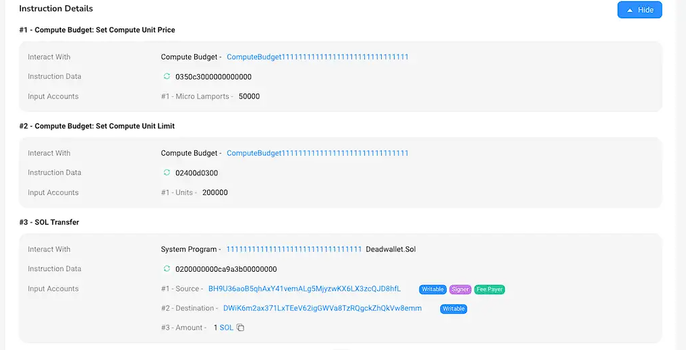

# Solana 基础概念

## Unit1 - Solana 的故事

### Solana 背景介绍

#### Solana 的历史

- 2017年11月，Anatoly Yakovenko发表了一篇白皮书，介绍了“Proof of History”这一技术（我们会在后续章节详细介绍），用于在不信任彼此的计算机之间进行时间同步。Anatoly 有在高通、Mesosphere 和Dropbox 设计分布式系统的经验，他知道有了可靠的时钟，网络同步就会变得很简单，而简单的同步能让网络运行得非常快，只受网络带宽限制。

- Anatoly 注意到像比特币和以太坊这样没有时钟的区块链系统只能达到每秒 15 次的交易速度，而如果希望搭建一个世界中心化支付系统（如Visa）则需要峰值65,000次每秒的交易速度。 没有时钟，很明显他们永远无法像 Visa 那样成为全球支付系统。当 Anatoly 解决了计算机之间时间不一致的问题时，他意识到这是将多年的分布式系统研究应用到区块链领域的关键。他的解决方案不仅提高了效率，而且速度提高了成千上万倍。

- Anatoly 一开始是在自己的 Github 中使用 C 语言实现了 Solana 的原型。曾在高通与 Anatoly 一起合作的 Greg Fitzgerald 鼓励他以 Rust 语言重新编写这个项目。Anatoly 两周内就完成了迁移到 Rust 的工作，并把这个项目命名为 Loom。

- 2018年2月13日，Greg Fitzgerald 开始为 Anatoly 的白皮书创建开源实现的原型。2月28日，Greg 就发布了首个版本，这个版本在半秒内就可以验证和处理超过10,000个签名交易。不久之后，另一位之前在高通工作的同事 Stephen Akridge 展示了如何通过图形处理器来验证签名，大大提高了处理速度。Anatoly 邀请 Greg、Stephen 和其他三个人共同创办了一家名为 Loom 的公司。

- 同一个时候，一个基于以太坊的项目 Loom Network 出现了，很多人经常把两个项目搞混。Loom团队决定重新给这个项目取个名字。最后他们决定把这个项目叫做 Solana 以纪念他们在圣地亚哥北部小海滩 Solana Beach 工作和冲浪的三年。2018年3月28日，团队创建了Solana 的 GitHub，并把Greg Fitzgerald 创作的原型命名为Solana。

### Solana & 以太坊

了解 **Solana** 和 **以太坊** 的差异

#### 一，共识上的差异

- **`Solana`** 使用的是 `Proof of History (PoH)` 与`Proof of Stake (PoS)` 的结合，使得网络能够达到**每秒数千笔**交易处理速度。PoH 是 Solana 独有的创新性机制，用于记录和验证区块的时间戳和顺序。
  - PoH 通过在每个区块中引入时间证明，使得节点能够迅速达成共识，而无需等待整个网络确认。
  - 而 Solana 的 PoS 机制用于选择验证者。验证者是通过抵押一定数量的代币来参与网络验证的。持有更多代币的验证者有更大的机会被选中生成新的区块和验证交易。
  - 因此，PoH 确保区块的时间戳和顺序，PoS 则确保网络的安全性和抗攻击性，这使得 Solana 成为一个适用于高性能去中心化应用和高频交易场景的区块链平台。
- **以太坊** 于2022 年 9 月完成了从 `Proof of Work (PoW)` 到 `Proof of Stake (PoS)` 的以太坊2.0版本升级，将保护以太坊安全所需的能源消耗减少了 **99.95%**，同时创建一个**更安全、碳成本更低的以太坊网络**。

#### 二，交易处理能力

- **`Solana` **支持对交易的并行处理，通过将交易分成多个子集，并将每个子集分配给不同的验证节点进行处理，从而实现交易的并行处理。
  - 这种方法可以显著提高交易吞吐量，同时保证交易的安全性和可靠性。
  - Solana 的平均出块时间为 400 毫秒，平均每秒 2000+ 笔交易，在高负载时保持较低的交易费用。

- **以太坊** 每笔交易串行执行，一笔交易执行完成再开始下一笔交易，状态依次更新，这也限制了以太坊吞吐量长期维持在**每秒 15 笔～30 笔**，以牺牲性能换来安全性和一致性。不过以太坊交易处理能力的提升，主要是通过 `Layer2` 的 `Rollup` 方案来实现的，Rollup 将数百笔交易捆绑（“打包”）为以太坊网络上的单笔交易，能够将燃料费减少多达100倍，同时，24年初即将上线的 **Proto-Danksharding** 升级，会进一步降低 gas 费，提升交易吞吐量。

#### 三，交易费用（Gas 费）

- **`Solana` **它的交易费用是根据交易的复杂度和大小动态计算的，这意味着，交易费用会根据交易的执行成本而变化，而不是根据网络上的交易量变化。
  - Solana 的平均交易费用通常低于 0.01 美元，平均为 0.00025 美元，这使得进行小额交易更具成本效益。

- **以太坊** 的交易费用因网络拥堵而波动，这是一种纯粹的市场机制，网络中交易拥堵情况下你的交易要想被确认，就需要支付高昂的手续费。目前一笔转账交易的手续费大概在 1 ～ 10 美元左右。但其 `EIP-1559` 升级引入了一种新的费用市场机制，旨在使费用更可预测

#### 四，智能合约

- **`Solana`** 中一切皆账户，它的智能合约（Solana 中称之为**程序** `program`，后续也统一使用“程序”这一术语）也是账户，但细分为**可执行账户**和**数据账户**，前者存储程序的代码，用来执行特定的逻辑，后者存储状态，即程序运行时的数据。这种分离的模式，使得程序的升级更加简单，因为程序本身无状态，可以直接升级为新的代码逻辑。

- **以太坊** 的智能合约本身就包含了合约的逻辑代码，以及状态数据。因此合约部署之后，就不支持直接的升级，只能通过代理的方式间接升级，即重新部署一套合约代码，生成新的合约地址，代理再指向这个新的合约地址。

#### 五，账户

- **`Solana`** 中一切皆账户，它的账户就像一个容器（或者电脑中的文件夹），可以包含程序代码、状态数据以及账户元数据。按照功能可划分为**可执行账户**和**数据账户**，前者为存储程序代码的账户，也称为程序账户。后者包括**普通用户账户**和其他非程序账户，这些账户存储了用户的余额、交易历史和其他相关数据，但它们本身不包含程序代码。对于熟悉以太坊账户的同学来说，这种划分方式也许有点奇怪，不过随着了解的深入，就会认识到 Solana 的单一账户模型，使得多个交易能够并行处理，这正是 Solana 高性能的基础。
- **以太坊** 分为 **EOA 账户**和**智能合约**，前者是普通用户在以太坊网络中的账户，用于存储以太币（ETH）和进行交易。后者是包含智能合约代码和状态的账户，这些账户由合约创建并部署在以太坊区块链上。通过这两种账户类型的结合，以太坊提供了一个灵活且功能强大的去中心化应用开发平台。

#### 六，编程语言和开发友好性

- **`Solana`**支持包括 Rus t和 C 在内的多种编程语言，这些语言以高性能而闻名。

- **以太坊** 的 `Solidity` 语言是为智能合约设计的，拥有大量的开发工具和广泛的开发者社区，这为新加入的开发者提供了丰富的资源和支持。

#### 七，生态系统和用户基础

- **`Solana`** 正在快速建立其生态系统，但相对于以太坊来说还较新，存在很多机会。

- **以太坊** 拥有最大的去中心化应用（DApp）生态系统，以及广泛的用户和开发者社区，这为其提供了强大的网络效应和更高的去中心化程度。

#### 小结

通过比较，我们会发现每个平台都有自己的优势和挑战：

- 以太坊的广泛采用和成熟的生态系统为其提供了稳定性和信任

- 而 Solana 的高性能和低成本则为那些需要这些特性的应用提供了优势

## Unit2 - Solana 的共识机制

### Solana PoH

#### Hash 函数

- Solana 的 PoH 共识机制中使用的哈希函数是 SHA-256，这是一种安全哈希算法，它将任意长度的输入（也称为消息）转换为一个固定长度的输出。它的作用主要是为了确保网络的时间顺序性和安全性

#### PoH 的工作流程

- 我们看一个简化版的 PoH 工作流程，从一个随机值开始，运行 hash 函数，并将输出（output）作为输入（input）再次运行该函数。记录函数执行的次数（index）以及每次调用的结果（output)。次数，提供了顺序和时间两个维度的支持；将输出作为输入，依次头尾相连，形成了一条完整的证据链
- hashN 代表实际的 Hash 输出，Solana 中每个交易都与前一笔交易的哈希相连接，形成一个由交易构成的链，当一定数量的交易都被执行并构成了PoH 链后，它们被打包到一个区块（slot）中
- 只要选择的哈希函数是抗碰撞的，这个哈希集和就只能被单线程顺序计算出来。这满足了在 index 为 300 时，如果不通过算法实际运行 300 次，无法获得这样的结果的设定
- 因此，我们可以从数据结构中推测出从 index 0 到 index 300 真实的过去的时间。这样以来，在网络中尽管每个节点的时间戳可能会有不一致，但是我们通过 hash 的次数（比如300），就变相的替代了时间，于是网络中有了全局一致的时间钟，并保持了交易的顺序

#### PoH 的可验证性

- 由于PoH流是可验证有序的，在进行hash计算时我们会加入额外数据，如：Hash次数，事件信息等。
- 因此，无论数据消息以多快的速度或多少被记录到基于PoH的数据结构中，我们都可以通过输入指定的次数和事件信息等来确定hash(区块)的先后顺序

#### PoH 的广播

- 当生成一个新区块时，我们可以将块的数据和结构进行切片并同时在多核GPU上并行运行验证，当验证完成后将会在Solana网络上进行广播。同时，由于区块的时序性，并且在各个节点中有一致的时间钟，我们很容易验证区块的有效性并且确定区块的先后顺序

### Solana PoS

先来了解下在 Solana的系统架构中最重要的两种角色：**Leader**（出块者）和 **Validator**（验证者）。两者实际上都是质押了 SOL 代币的全节点，只是在不同的出块周期内，Leader 会由不同的全节点来充当，而没有当选 Leader 的全节点会成为 Validator。 所以在选择验证者方面， Solana 采用的是 **`PoS`**（权益证明）机制，验证者是通过抵押一定数量的代币来参与网络交易的验证的，持有更多代币的验证者有更大的机会被选中生成新的区块。


- 用户发起交易后，会被客户端直接转发给 Leader 节点，或者先被普通节点接收，再立刻转发给 Leader
- 出块者 Leader 接收网络内全部的待处理交易，一边执行，一边给交易指令排序，制成交易序列（类似区块）。每隔一段时间，Leader 会把排好的交易序列发送给 Validator 验证节点
- Validator 按照交易序列（区块）给定的顺序执行交易，产生相应的状态信息State（执行交易会改变节点的状态，比如改变某些账户的余额）
- 每发送 N 个交易序列，Leader 会定期公开本地的状态 State，Validator会将其与自己的 State 作对比，给出 肯定/否定 的投票。这一步就类似于 以太坊2.0 或其他 POS 公链里的“检查点”
- 如果在规定时间内，Leader收集到占全网 2/3 质押权重的节点们给出的肯定票，则此前发布的交易序列和状态 State 就被敲定，“检查点”通过，相当于区块完成最终确认 Finality
- 一般而言，给出肯定票的 Validator 节点与出块者 Leader 所执行的交易、执行后的状态都是相同的，数据会同步

#### Solana 如何通过 PoS 指定 Leader？

- 在 Solana 的共识协议中，有 Epoch（纪元）和 Slot（间隔）两大时间单位。每个 Slot 约为 0.4 ~ 0.8 秒，相当于一个区块的时间间隔。而每个Epoch周期包含 43.2 万个 Slot（区块），长达 2 ~ 4 天。每过 4 个 Slot（出块周期），Leader节点就会进行一次变更


在每个新的Epoch周期开始时，Solana网络会按照各节点的质押权重进行抽选，组成一个出块者Leader轮换名单，“钦定”了未来不同时刻的出块者。也就是说出块者会提前获知他们成为出块者。 具体而言，究竟如何指定 Leader 会考虑诸多因素，比如：

- **质押的代币数量：** 在 PoS 中，质押的代币数量是一个关键的考虑因素。Validator 通常倾向于选择质押数量较大的节点，因为这增加了节点被选中为区块生产者的机会。这也有助于确保网络由具有足够利益参与的节点维护
- **节点的性能：** Validator 的节点性能是另一个关键因素。高性能的节点能够更快速地验证和打包交易，有助于维持网络的高吞吐量。Validator 可能会选择性能较好的节点以提高整个网络的效率
- **网络延迟：** Validator 可能会考虑节点之间的网络延迟。选择网络延迟较低的节点有助于减少区块的传播时间，从而提高网络的实时性
- **节点的可用性：** Validator 会关注节点的可用性，确保它们能够稳定运行而不容易出现故障。可靠的节点能够为网络提供更稳定的服务

Solana 要实现的目标是选择一组合适的 Leader，确保网络的安全性、效率和公平性。通过综合考虑这些因素，Solana 能够做出最佳的区块生产决策，从而推动网络的正常运行

#### 回顾

了解了基础的细节后，让我们来看看 Solana 的网络整体是如何通过 PoH 和 PoS 运作的：

- **生成交易：** 用户创建并广播交易，包含交易的详细信息和数字签名
- **PoH 链上的排序：** 交易的哈希通过数字签名连接到 PoH 链上。由于 PoH 链是有序的，交易也就被排序了
- **Validator** **验证：** Validator 负责验证交易的有效性，并选择哪些交易将包含在下一个区块中。Validator 的选择可能基于质押的代币数量、验证者的性能等因素
- **交易打包成区块：** Validator 选择的交易被打包成一个区块，其中包括一个特殊的块生产交易，它包含了当前 PoH 链的哈希以及其他信息
- **区块传播和确认：** 区块广播到整个网络，其他节点验证并确认区块的有效性。确认后，区块和其中包含的交易就被添加到整个区块链中

通过这个过程，Solana 通过 PoH 链的时间有序性和 PoS 的节点验证机制，实现了交易的流转和整个区块链的更新。这样的设计使得 Solana 平均出块时间被压缩至 400 毫秒，且无需 Layer2 即拥有较高速度，手续费亦可忽略不计

#### Solana 账户

学习 Solana 中最重要的概念之一 ：账户。账户之所以这么重要，是因为 Solana 作为一个分布式区块链系统，所有的信息都存储在账户中，如智能合约（Solana 叫 Onchain Program）、状态信息、Token数据、配置信息等都是存储在一个个账户中。

在学习 Solana 账户之前，让我们首先回顾一下以太坊的账户类型

以太坊将账户划分为两类：**外部账户（EOA）**和**合约账户（Contract Account）**

#### 外部账户

EOA-外部账户(external owned account)是由人们通过私钥创建的账户。 是真实世界的金融账户的映射，拥有该账户私钥的任何人都可以控制该账户。 如同银行卡，到ATM机取款时只需要密码输入正确即可交易。 这也是人类与以太坊账本沟通的唯一媒介，因为以太坊中的交易需要签名， 而只能使用拥有私有外部账户签名。大家通过 Metamask 创建的账户就属于外部账户。

外部账户特点总结：

- 拥有以太币余额
- 能发送交易，包括转账和执行合约代码
- 被私钥控制
- 没有相关的可执行代码

#### 合约账户

含有合约代码的账户。 被外部账户或者合约创建，合约在创建时被自动分配到一个账户地址， 用于存储合约代码以及合约部署或执行过程中产生的存储数据。 合约账户地址是通过SHA3哈希算法产生，而非私钥。 因无私钥，因此无人可以拿合约账户当做外部账户使用。 只能通过外部账户来驱动合约执行合约代码。

让我们来理解一下外部账户和合约账户的异同

| 项              | 外部账户 | 合约账户             |
| --------------- | -------- | -------------------- |
| 私钥 secret Key | √        | ×                    |
| 余额 balance    | √        | √                    |
| 代码 code       | ×        | √                    |
| 控制方式        | 私钥控制 | 通过外部账户驱动合约 |

## Unit3 - 账户与程序

### Solana 账户

在以太坊中，我们将代码与数据、状态直接存储在智能合约中。而 Solana 账户最大的不同就是将两者分开存放在不同的账户上。所以 Solana 账户又分为**程序账户**和**数据账户**。（*说明：Solana中的智能合约并不叫“智能合约”，而是“程序program”，尽管它们代表的是相似的概念。为了避免混淆，后续我们将统一使用“程序”这一术语。*）

- **程序账户（可执行账户）**：存储不可变的数据，主要用于存储程序的代码（BPF 字节码）
- **数据账户（不可执行账户）**：存储可变的数据，主要用于存储程序的状态

Solana 链上程序是只读或无状态的，即程序的账户（可执行账户）只存储代码，不存储任何状态，程序会把状态存储在其他独立的账户（不可执行账户）中。如果一个程序账户是一个数据账户的所有者，那么它就可以改变数据账户中的状态

### Solana 账户2

#### Solana 的账户与租金

Solana 账户模型中还有一个特殊的「租金（Rent）」的概念。租金与交易费用不同。用户支付租金以将数据存储在 Solana 区块链上。而交易费用是为了处理网络上的指令而支付的。

与以太坊不同，Solana 会收取在其网络上的账户一笔用于存储数据状态的费用，即租金。如果账户无法支付租金，系统将删除这个账户，以减少为那些不再维护的数据花费存储成本。如果账户中的资产超过两年租金的最低余额，那么这个账户可以免交租金。Solana 上的租金存储费用为每字节 0.00000348 SOL/年，钱包数据大小为 372 字节，每个活跃钱包持有者必须保留 0.0026 SOL

#### 账户的分类

- 用户账户：普通的钱包用户，类似于以太坊的 EOA 账户。

- 程序账户：执行指定任务的账户，存储了程序的二进制文件，我们会在接下来的章节详细介绍。

- PDA(Program Derived Addresses)：程序派生地址。该类账户存储程序的状态，即程序执行过程中存储的数据，跟以太坊的状态是一个概念，只不过在这里被拆分到了单独的账户中。在下一节会进行专门的介绍。

- ATA(Associated Token Account)账户：关联账户。它是用户与特定的 SPL（Solana Program Library）Token 代币关联的账户，主要作用是允许用户方便管理他们持有的代币。

#### 账户的定义

通过一个账户的定义来回顾一下 Solana 账户的概念：

```rust
pub struct Account {
  /// 余额
  pub lamports: u64,
  /// 数据
  pub data: Vec<u8>,
  /// 所有者
  pub owner: Pubkey,
  /// 是否可执行账户
  pub executable: bool,
  /// 下次收租的时期
  pub rent_epoch: Epoch,
}
```

- **lamports**: 表示账户余额，lamport 是 Solana 中的基本货币单位，类似于以太坊的 **`wei`**。

- **data**：表示存储的内容，这是一个字节数组，可以包含任意类型的数据，如程序的状态、用户资产信息，以及存储程序的字节码等。

- **owner**：表示拥有或管理该账户的程序的公钥。这表示了哪个程序有权对该账户进行操作。如果账户包含的数据是可执行的，那么**`owner`**表示加载该账户的程序。

- **executable**：表示是否可执行，如果为 **`true`**，表示该账户中的数据可以被执行，是程序账户。如果为 **`false`**，表示该账户用于存储普通的数据，而不是可执行代码。

- **rent_epoch**：表示下一次该账户将被扣除租金的时期。Solana使用租金机制来防止账户被无限期占用而不使用，避免状态膨胀。

### PAD 是什么

学习一种特殊的账户—程序派生账户 PDA

#### 什么是 PDA？

在 Solana 区块链中，PDA 指的是“程序派生地址”（Program Derived Address）。这是一种特殊类型的地址，由 Solana 的程序生成，而不是由用户的私钥直接派生。**PDA 的主要目的是允许程序拥有和控制某些数据或资产，而不需要传统的私钥签名**。

#### 私钥，公钥和助记词

Solana 和以太坊一样，有私钥、公钥、助记词三种东西。私钥是私自保管不可示人的，当我们授权某一笔交易时，我们需要通过私钥签名并“授权”该交易。私钥是一串乱码，不好记，与之对应有一串助记词。助记词可以通过算法推出私钥，所以实际上我们在使用钱包时，只要记住助记词。而我们可以通过加密算法从私钥推算出公钥。公钥是可以展示给别人看的，别人通过你的公钥给你转账，同时公钥也是程序的地址，也叫 **`program_id`**。

要注意的是我们只能从助记词通过加密算法推算出私钥，从私钥推算出公钥，而无法反向从公钥推算出私钥，从私钥推算出助记词。否则我们所有加密地址中的代币都可以被任何人控制了。这其中的过程通过 **`ECDSA`** 算法进行计算，如果希望了解具体的原理可以先从了解 **`ECDSA`** 算法开始。但是理解 PDA 账户可以不必这么深入，让我们先把这个过程进行一个简化


如上图所示（这是一个简化的图示），每一个 X 轴私钥会在曲线上对应一个 Y轴公钥，**但是 Q 点的 公钥没有对应任何一个 X 轴上的私钥。那么这就意味着这个公钥没有对应的私钥！**这意味着这个公钥不是从私钥派生/衍生（Secret Key Derived）出来的。

这就是 PDA 的原理，“程序派生地址”（Program Derived Address）是没有对应的私钥的，它是由一个程序的**`program_id`** 和 **`seed`** 派生/衍生出来的，这也是为什么它被称之为“程序派生地址”（Program Derived Address）。有时候我们通过 program_id 和 seed 获得的公钥正好有对应的私钥，那么这种情况下我们就需要重新生成一个公钥，通常是在我们的 program_id 和 seed 之外再加上一个数字（这个数字有个专有名词叫 bump），这个数字从 255 开始，依次往下，直到生成的公钥没有私钥为止。

#### 为什么需要 PDA

在区块链中，你需要一个私钥来证明你拥有一个公钥的所有权，同时你才能签字同意这个账户的转账请求。但如果这个账户的所有者不是一个人而是一个去中心化程序，那么把私钥放在这个程序上就不是一个好主意，因为所有程序代码都在链上都是公开的，如果所有人都能看到你的私钥，那么人们就能进行一些恶意操作，比如偷走你的代币。这时我们就需要一个没有私钥的 PDA。 这样程序不需要私钥就能对一个地址进行签名操作

#### 如何生成 PDA 地址

这里我们使用 Solana 的 **`Anchor`** 开发框架，实现 PDA 账户的初始化（Anchor 框架我们会在后续章节专门介绍，这里只是让大家简单了解下 PDA 账户的生成过程）

```rust
// PDA 账户存储的数据
pub struct Counter {
    count: u64
}
```

这个 PDA 账户存储的是 **`Counter`** 结构的数据，它包含了一个 **`u64`** 类型的 **count** 值

```rust
pub struct InitializeAccounts<'info> {
		#[account(
			init, 
			seeds = [b"my_seed", 
							 user.key.to_bytes().as_ref()
							]
			bump,
			payer = user, 
			space = 8 + 8
		)]
		pub pda_counter: Account<'info, Counter>,
}
```

其中的 **`pda_counter`** 字段为要生成的PDA 账户，我们标记了初始化时用到的 **`seeds `**值及 **`bump`**，其中的 seeds 可以是根据业务场景设置的任意字节数组，Anchor 默认使用符合条件的第一个 bump 值，不需要我们手动指定，同时Anchor 内部也会自动获取 **`program_id`**，同样不需要我们手动指定。

但是我们需要指定账户所占用的空间大小 **`space`** 以及支付初始化交易费的账户 **`payer`**。这里指定账户的空间大小为16个字节，前 8 个字节存储 Anchor 自动添加的鉴别器，用于识别帐户类型。接下来的 8 个字节为存储在**`Counter`** 帐户类型中的数据分配空间（**`count`** 为 u64 类型，占用 8 字节），space 主要用于计算账户在网络中的租金。

以上就是生成 PDA 账户的部分代码示意，虽然并不完整，但向我们展示了 PDA 账户涉及到的相关内容：program_id 程序ID、seed 种子、bump 值、space 空间。后续章节会进行详细的介绍

### Solana 程序

学习 Solana 中的程序 program

#### 什么是程序

Solana 程序，在其他链上叫做智能合约，是所有链上活动的基础。任何开发者都可以在 Solana 链上编写以及部署程序。 链上的一切活动，从去中心化金融（DeFi），到非同质化代币（NFT），再到社交媒体，链上游戏，都由Solana程序所驱动

#### Solana 的程序有哪几种

通常可以分为以下两种：

- **On-chain Programs：**这些是部署在 Solana 上的用户编写的程序，由开发者在 Solana 网络上根据具体业务场景开发的程序。它们可以通过升级权限进行升级，该权限通常是部署程序的帐户或者指定的其他账户。

- **Native programs：**这些是集成到 Solana 核心模块中的程序。它们提供了验证节点（validator）运行所需的基本功能。native programs 只能通过网络范围内的软件更新进行升级。常见的原生程序有 [System Program](https://docs.solana.com/developing/runtime-facilities/programs#system-program)、[BPF Loader Program](https://docs.solana.com/developing/runtime-facilities/programs#bpf-loader) 、[Vote program](https://docs.solana.com/developing/runtime-facilities/programs#vote-program) 和 [Solana Program Libraries - SPL](https://spl.solana.com/)等。其中 [System Program](https://docs.solana.com/developing/runtime-facilities/programs#system-program) 这个程序负责管理建立新账户以及在两个账户之间转账SOL。[Solana SPL](https://spl.solana.com/) 程序定义了一系列的链上活动，其中包括针对代币的创建，交换，借贷，以及创建质押池，维护链上域名解析服务等。

#### Solana 的程序的特点

Solana 程序模型的显着特征之一是**代码和数据的分离**。程序存储在程序账户中，它是无状态的，这意味着它们不会在内部存储任何状态，但它是可执行的 **`executable`**，会执行相应的逻辑。相反，它们需要操作的所有数据都存储在单独的数据帐户中，这些帐户在 Transaction 交易中通过引用传递给程序账户，因为它本身是不可执行的


 Solana中将程序和状态分离的设计，这是很多以太坊开发者来到Solana生态最大的困惑，但这样的设计确实带来了很大的好处：

程序可以独立于状态进行开发、测试、部署和升级，提高了程序的可重用性和可扩展性。相反在以太坊中，智能合约和状态是绑定到一起的，合约的升级是一件非常麻烦的事情，必须通过代理模式间接实现逻辑和状态的分离，才可以进行逻辑的升级，并且在新的智能合约中，新增变量的处理要非常小心，避免存储布局 Layout 冲突，覆盖掉旧变量。

此外，由于状态数据是以账户的形式存储在网络中，因此可以方便地进行分片和并行处理，从而提高了 Solana 网络的吞吐量和效率。

所以，Solana中的程序和状态分离的设计提高了程序的可重用性和可扩展性，同时也提高了Solana网络的吞吐量和效率，使得网络的升级和维护变得更加容易

#### 如何编写程序

这里我们看一个简单的 solana 程序，这是 Rust 编写的 hello world 程序，实现了简单的日志打印。通常我们将程序写在 **`lib.rs`** 文件中：

```rust
// 引入 Solana 程序的相关依赖
use solana_program::{
    account_info::AccountInfo,
    entrypoint,
    entrypoint::ProgramResult,
    pubkey::Pubkey,
    msg
};

// 程序入口点
entrypoint!(process_instruction);

// 指令处理逻辑
pub fn process_instruction(
    program_id: &Pubkey,
    accounts: &[AccountInfo],
    instruction_data: &[u8]
) -> ProgramResult{
    msg!("Hello, world!");

    Ok(())
}
```

所有的程序都有一个单独的入口点，类似于 Rust 中的main函数，指令的执行就是从这里开始的（即process_instruction），参数须包括：

- program_id: pubkey （程序ID，即程序地址）

- accounts: AccountInfo数组，指令所涉及的账户集合。

- instruction_data: byte array字节数组，即指令所需的参数，该例子中并没有用到

在实际的项目中，通常不会把所有逻辑都写在lib.rs文件中，为了更清晰的划分功能模块，大部分程序遵循以下架构：

| 文件           | 描述                                         |
| -------------- | -------------------------------------------- |
| lib.rs         | 注册模块                                     |
| entrypoint.rs  | 程序的入口                                   |
| instruction.rs | 程序的 API，对指令的数据进行序列化与反序列化 |
| processor.rs   | 程序的业务逻辑                               |
| state.rs       | 程序对象，对状态进行反序列化                 |
| error.rs       | 程序中制定的错误                             |

[Anchor](https://www.anchor-lang.com/) 逐渐成为了一个广受欢迎的Solana程序开发框架，它通过减少样板代码并简化序列化和反序列化来简化程序的创建。在后续的章节，我们也会有专门的介绍

## Unit4 - 指令与交易费

### 交易与指令

#### 交易（Transaction）

交易是一组原子性的操作，代表对区块链状态的一系列更改，包括转账代币、调用程序、更新账户状态等。每个交易都具有唯一的签名，并由一个或多个指令组成。交易费用的支付通常使用 Solana 的原生代币 SOL。

**签名：**每个交易都必须由一个或多个账户的私钥进行签名，以确保交易的身份和完整性。

#### 指令（Instruction）

指令是交易中的一条具体指令，包含执行指令所需的具体数据，可以包括执行指令的程序唯一标识 program_id、账户列表、指令参数、配置信息等，用于执行一个特定的操作。

多个指令组成的交易可以实现多个不同的操作，形成一个**原子性**的事务。

当我们需要通过 Solana 发起一笔转账，或者调用一个程序时我们就需要通过交易（Transaction）来来完成。每个交易都包含：

- **`instructions`**：一个或多个指令

- **`blockhash`**：最新的块哈希值

- **`signatures`**：指令对应的发起人的签名

我们通过交易与 Solana 发生交互，而交互的最小单元就是交易中的指令（Instruction）。一个交易可以打包多个指令，指令指定调用哪个程序，要读取或修改哪些账户，以及执行程序需要的额外数据。

在进行一笔转账交易后我们可以在区块链浏览器查看相关操作，就可以看见一笔转账交易包含了三个指令: 

- **Compute Budget：Set Compute Unit Price**：设置单个 CU 的价格
- **Compute Budget：Set Compute Unit Limit**：设置最多能消耗的 CU 的数量
- **Sol Transfer**：进行一次转账


### 交易费与确认

在上一章提到什么是交易与指令，那么执行一个交易就需要 **Compute unit。**

如果你熟悉 EVM，**CU(Compute unit)** 就像是 gas fee

当然如果你不熟悉也没关系，Solana 就像个由多个节点连接组成的公共巨型计算机，节点运行者往往需要投入大量的物理资源(如 CPU, GPU)来维持巨型计算机的稳定运行，为了奖励节点运行者处理链上大量的交易维持网络的稳定，gas 费将做为他们贡献的补偿。

当然 CU 的存在还有一些别的目的，比如：

1.通过对交易引入实际成本，减少网络垃圾

2.设定每笔交易的最低费用金额，为网络提供长期的经济稳定性

因此，当用户在链上发送一笔交易时，往往需要支付一笔手续费用于处理交易中所包含的指令


以下的一些操作会产生 **Compute unit**：

- 执行SBF指令

- 在程序之间传递数据

- 调用系统调用

- 记录日志

- 创建程序地址

- 跨程序调用

#### CU 最大限制

由于每笔交易中所包含的指令调用数量和数据量的不同，每笔交易都设定了**最大的CU限制**——”**compute budget**”以确保单笔交易的数据量不会过大从而造成网络的拥堵。

每条指令的执行都会消耗不同数量的CU，在消耗了大量的CU后(即消耗的CU已经超出了”compute budget”所限定的最大CU)，指令运行将停止并返回错误，从而导致交易失败。

#### 交易费

在一笔转账交易中，我们可以看到其中包含了对于**CU limit**和**CU price**的设置。

指令 **`Set Compute Unit Price`** 中，可以看到 **`compute budget`** 程序将每 CU 的价格设定为 **`50000`** lamports (**1 SOL = 1000,000,000 lamports**)

指令 **`Set Compute Unit Limit`** 中，**`compute budget`** 程序将该笔交易的 CU 消耗上限设置为 **200,000**； 当一笔交易所有的指令CU消耗超过了 200,000 时，交易将会失败。

手续费的计算公式为: **CU数量 \* CU价格 = 手续费用**



#### 交易的确认

一笔交易在根据在solana网络上的确认程度可以分为以下几类主要状态:

- **`processed`**:  查询已通过连接节点获得 1 次确认的最新区块
- **`confirmed`**:  查询已通过集群获得 1 次确认的最新区块
- **`finalized`**:  查询已由集群完成的最新区块

| 属性                             | processed | confirmed | finalized |
| -------------------------------- | --------- | --------- | --------- |
| 收到的区块                       | √         | √         | √         |
| 在主要分叉上的区块               | √         | √         | √         |
| 区块包含目标交易                 | √         | √         | √         |
| 66%+ validator 投票给该交易区块  | -         | √         | √         |
| 31+ 已确认的区块建立在该区块之上 | -         | -         | √         |

