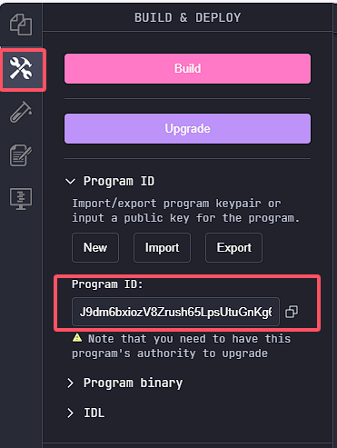
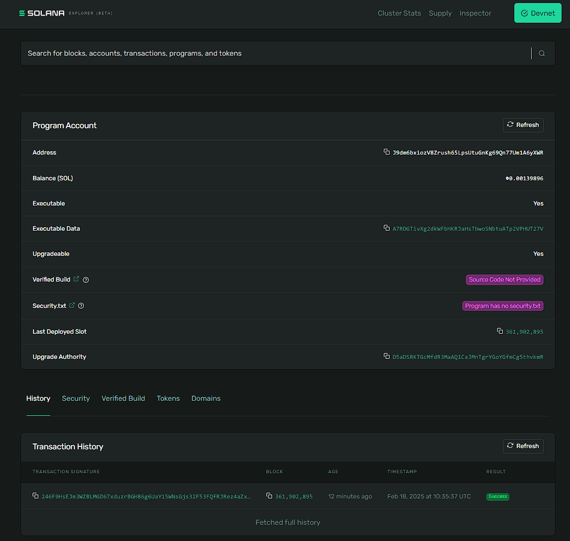
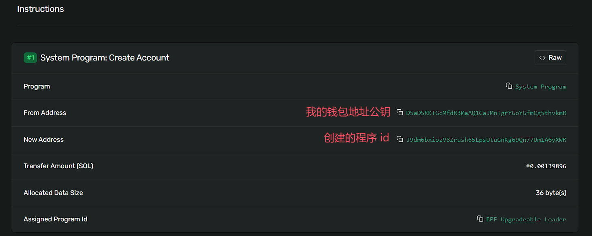
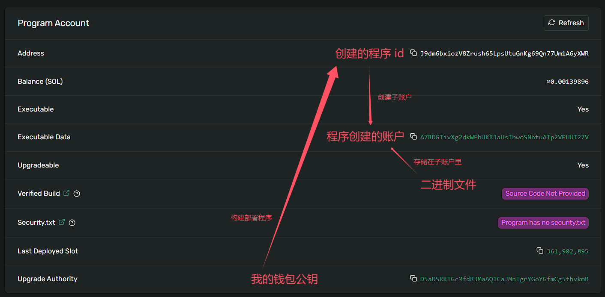

# 开发一个 solana 程序

#### 核心 crate

solana-program = “2.2.1”

#### 入口函数声明

```rust
use solana_program::entrypoint; 
// 我们需要的 entrypoint! 是个宏，
// 所以声明时最好单独提取出来，不然和下方的声明在一起为 
// use solana_program::entrypoint{self,ProgramResult} 的话会报错

use solana_program::entrypoint::ProgramResult; 
// ProgramResult 是 solana 中定义的一个通用错误处理类型，可以用于入口函数的返回类型
// 成功返回 ()，失败返回 ProgramError；ProgramError也是个枚举

use solana_program::program_error::ProgramError; 
// ProgramError 中定义了 23 种常见的错误原因枚举值，也支持自定义的错误类型

use solana_program::account_info::AccountInfo; 
// account_info 模块中的一个结构体，允许我们访问帐户信息

use solana_program::pubkey::Pubkey;
// pubkey 模块中的一个结构体，允许我们将地址作为公钥访问

use solana_program::msg;
// 一个允许我们将消息打印到程序日志的宏，类似于 Rust 中的 println宏

entrypoint!(process_instruction);

fn process_instruction(
    // 当前程序 id
    program_id: &Pubkey,
    // 指令涉及的账户集合
    accounts: &[AccountInfo],
    // 指令的参数
    instruction_data: &[u8],
) -> ProgramResult {
    // ... 逻辑处理
    Ok(())
}
```

### 数据账户定义

```rust
use borsh::{BorshDeserialize, BorshSerialize};
// 由于 solana 在发起交易指令时，值的存储和传输使用的是字节码，所以需要把字节码转为 Rust 类型
// 所以这里需要 BorshDeserialize 和 BorshSerialize 这两个派生宏来实现 (反)序列化
// 它们都是对解析后类型为TokenStream的 Rust 代码元数据进行处理，并返回处理后的元数据

/// 定义数据账户的结构
#[derive(BorshSerialize, BorshDeserialize, Debug)]
pub struct CounterAccount {
    pub count: u32, // 使用 count 来计数，当账户发起交易指令时 count += 1
}
```

borsh 需要在 Cargo.toml 中引入

```toml
borsh = "1.5.1"
```

### 指令处理

#### 获取账户

为了处理指令，指令所需的数据账户必须通过 accounts 参数显式传递到程序中

因为要对数据账户进行累加的操作，所以 accounts 包含了该数据账户，我们可以通过迭代器获取到该账户 account

```rust
use solana_program::account_info::next_account_info;

pub fn process_instruction(
    // 程序ID，即程序地址
    program_id: &Pubkey,
    // 该指令涉及到的账户集合
    accounts: &[AccountInfo]) -> ProgramResult 
{
    // 账户迭代器
    let accounts_iter = &mut accounts.iter();
    // 获取调用者账户
    let account = next_account_info(accounts_iter)?;

    // ……
    Ok(())
}
```

#### 账户权限校验

account数据账户是由该程序派生出来的账户，因此当前程序为它的owner所有者，并且只有所有者才可以对其进行写操作。所以我们在这里要进行账户权限的校验

```rust
use solana_program::account_info::next_account_info;

pub fn process_instruction(
    // 程序ID，即程序地址
    program_id: &Pubkey,
    // 该指令涉及到的账户集合
    accounts: &[AccountInfo]) -> ProgramResult 
{
    // 使用accounts的迭代器获取账户
    let accounts_iter = &mut accounts.iter();
    let account = next_account_info(accounts_iter)?;
	
    // 权限校验，验证调用者身份
    if account.owner != program_id{
        msg!("account 的所有者不属于当前 program_id");
        return Err(ProgramError::IncorrectProgramId);
    }
    
    // ……
    Ok(())
}
```

#### 读取数据账户

权限校验 ok 后，接下来就是读取账户存储的数据

这时候，我们就需要从 account 数据账户中反序列化出 CounterAccount 结构体的实例，这样就能读取到该账户的数据了

```rust
pub fn process_instruction(...) -> ProgramResult{
	// 获取账户
	// 权限校验
	// 反序列化获取 counter
	let mut counter = CounterAccount::try_from_slice(&account.data.borrow())?;
}
```

- **`&account.data`**：获取账户的数据字段的引用。在 Solana 中，账户的数据字段 **`data`** 存储着与账户关联的实际数据，对于程序账户而言，它是程序的二进制内容，对于数据账户而言，它就是存储的数据。

- **`borrow()`**：使用该方法获取data数据字段的不可变引用。并通过 **`&account.data.borrow()`** 方式得到账户数据字段的不可变引用。

- **`CounterAccount::try_from_slice(...)`**：调用 ==try_from_slice== 方法，它是 **`BorshDeserializetrait`**  的一个方法，==用于从字节序列中反序列化出一个结构体的实例==。这里 **`CounterAccount`** 实现了 **`BorshDeserialize`** ，所以可以使用这个方法。

- **`?`**：是一个错误处理操作符，如果 **`try_from_slice`** 返回错误，整个表达式将提前返回，将错误传播给调用方。

通过如上方式，我们获取了 **`CounterAccount`** 数据账户进行了反序列化，并获取到它的可变借用

#### 修改数据账户

获取到数据账户反序列化后的可变借用，就可以对数据账户信息进行修改

修改后再序列化为字节数组并写入到 solana 账户的可变数据字段中

```rust
pub fn process_instruction(...) -> ProgramResult{
	// 获取账户
	// 权限校验
	// 反序列化获取 counter
	let mut counter = CounterAccount::try_from_slice(&account.data.borrow())?;
    // counter 的 count 计数 +1
    counter.count +=1;
    // 序列化 counter 为字节数组 并写入 数据账户的 data
    counter.serialize(&mut *account.data.borrow_mut())?;
    Ok(())
}
```

- 首先对 **`CounterAccount`** 结构体中的 **`count`** 字段进行递增操作。

- **`&mut *account.data.borrow_mut()`**：通过 **`borrow_mut()`** 方法获取账户数据字段的可变引用，然后使用 **`*`** 解引用操作符获取该 **`data`** 字段的值，并通过 **`&mut`** 将其转换为可变引用。

- ==serialize== 函数方法，它是 **`BorshSerialize`** trait 的一个方法，用于将结构体序列化为字节数组。

- **`?`**：是一个错误处理操作符，如果 **`serialize`** 方法返回错误，整个表达式将提前返回，将错误传播给调用方。

通过如上的方式，将 **`CounterAccount`** 结构体中的修改后的值递增，并将更新后的结构体序列化为字节数组，然后写入 Solana 账户的可变数据字段中。实现了在 Solana 程序中对计数器值进行更新和存储。

### 构建部署到 devnet

当前使用的是 [Solana Playground | Solana IDE](https://beta.solpg.io/) 网站进行构建部署

Build 代码成功后，执行 Deploy



此处可以看到当前部署的程序 id

再使用该 program id 去 [solana区块链网站](https://explorer.solana.com/?cluster=devnet) 上搜索，就可以查询到该程序部署的信息



最下方的交易历史点开可以查看具体部署的详情





### 测试脚本调试该 solana 程序

#### 首次调试

测试脚本主要做了以下几件事

##### 创建计数器对象

```js
/**
 * CounterAccount 对象
 */
class CounterAccount {
  count = 0;
  constructor(fields: { count: number } | undefined = undefined) {
    if (fields) {
      this.count = fields.count;
    }
  }
}

/**
 * CounterAccount 对象 schema 定义
 */
const CounterAccountSchema = new Map([
  [CounterAccount, { kind: "struct", fields: [["count", "u32"]] }],
]);

/**
 * 账户空间大小
 */
const GREETING_SIZE = borsh.serialize(
  CounterAccountSchema,
  new CounterAccount()
).length;
```

这里定义了一个 **`CounterAccount`** 类，并使用构造函数初始化对象实例。创建了一个 **`CounterAccountSchema`** 对象，该对象定义了 **`CounterAccount`** 类的序列化规则。接下来计算了序列化一个 **`CounterAccount`** 对象所需的字节数 **`GREETING_SIZE`**，这个值将用于后续创建账户时确定账户空间的大小

##### 创建数据账户的指令

```js
describe("Test", () => {
  it("greet", async () => {
    // 创建 keypair
    const counterAccountKp = new web3.Keypair();
    console.log(`counterAccountKp.publickey : ${counterAccountKp.publicKey}`)
    const lamports = await pg.connection.getMinimumBalanceForRentExemption(
      GREETING_SIZE
    );

    // 创建生成对应数据账户的指令
    const createGreetingAccountIx = web3.SystemProgram.createAccount({
      fromPubkey: pg.wallet.publicKey,
      lamports,
      newAccountPubkey: counterAccountKp.publicKey,
      programId: pg.PROGRAM_ID,
      space: GREETING_SIZE,
    });


    // ...
  });
});
```

- 创建了一个新的 Solana Keypair (**`counterAccountKp`**) 用于存储计数器的状态。

- 使用 Solana API 获取在链上创建相应账户所需的最小 lamports，即 Solana 链上存储该账户所要支付的最小押金 **`rent`**。

- 构建 **`createGreetingAccountIx`** 指令，在链上创建我们指定的 **`counterAccountKp.publicKey`** 账户，并指定了账户的大小。

##### 调用 solana 程序的指令

接下来我们创建如下指令，调用之前部署的 Solana 程序，并传入对应的数据账户 **`counterAccountKp.publicKey`**来存储计数器状态，计数器程序会在该账户 data 的基础上累加，因此计数器从初始值 0 变为 1

```js
describe("Test", () => {
  it("greet", async () => {
    // 创建 keypair
    // 创建生成对应数据账户的指令
    
    // 调用程序的指令,计数器累加
    const greetIx = new web3.TransactionInstruction({
      keys: [
        {
          pubkey: counterAccountKp.publicKey,
          isSigner: false,
          isWritable: true,
        },
      ],
      programId: pg.PROGRAM_ID,
    });
	// ...
  });
});
```

##### 创建交易发送上面两个指令

```js
describe("Test", () => {
  it("greet", async () => {
    // 创建 keypair
    // 创建生成对应数据账户的指令
    // 调用程序的指令,计数器累加

    // 创建交易，包含如上2个指令
    const tx = new web3.Transaction();
    tx.add(createGreetingAccountIx, greetIx);
    // 发起交易，获取交易哈希
    const txHash = await web3.sendAndConfirmTransaction(pg.connection, tx, [
      pg.wallet.keypair,
      counterAccountKp,
    ]);
    console.log(`Use 'solana confirm -v ${txHash}' to see the logs`);

    // ...
  });
});
```

##### 查看程序执行结果

调用 **`getAccountInfo`**函数获取指定地址的数据，通过反序列化就可以把二进制数据转换成我们的计数器对象，此时它的值为 1

```js
describe("Test", () => {
  it("greet", async () => {
    // 创建 keypair
    // 创建生成对应数据账户的指令
    // 调用程序的指令,计数器累加
    // 创建交易，包含如上2个指令
      
    // 获取指定数据账户的信息
    const counterAccountOnSolana = await pg.connection.getAccountInfo(
      counterAccountKp.publicKey
    );
    // 反序列化
    const deserializedAccountData = borsh.deserialize(
      CounterAccountSchema,
      CounterAccount,
      counterAccountOnSolana.data
    );
    // 判断当前计数器是否累加
    assert.equal(deserializedAccountData.count, 1);
  });
});
```

##### 完整代码

```js
// No imports needed: web3, borsh, pg and more are globally available

/**
 * CounterAccount 对象
 */
class CounterAccount {
  count = 0;
  constructor(fields: { count: number } | undefined = undefined) {
    if (fields) {
      this.count = fields.count;
    }
  }
}

/**
 * CounterAccount 对象 schema 定义
 */
const CounterAccountSchema = new Map([
  [CounterAccount, { kind: "struct", fields: [["count", "u32"]] }],
]);

/**
 * 账户空间大小
 */
const GREETING_SIZE = borsh.serialize(
  CounterAccountSchema,
  new CounterAccount()
).length;

describe("Test", () => {
  it("greet", async () => {
    // 创建 keypair
    const counterAccountKp = new web3.Keypair();
    console.log(`counterAccountKp.publickey : ${counterAccountKp.publicKey}`)
    const lamports = await pg.connection.getMinimumBalanceForRentExemption(
      GREETING_SIZE
    );

    // 创建生成对应数据账户的指令
    const createGreetingAccountIx = web3.SystemProgram.createAccount({
      fromPubkey: pg.wallet.publicKey,
      lamports,
      newAccountPubkey: counterAccountKp.publicKey,
      programId: pg.PROGRAM_ID,
      space: GREETING_SIZE,
    });


    // 调用程序,计数器累加
    const greetIx = new web3.TransactionInstruction({
      keys: [
        {
          pubkey: counterAccountKp.publicKey,
          isSigner: false,
          isWritable: true,
        },
      ],
      programId: pg.PROGRAM_ID,
    });

    // 创建交易，包含如上2个指令
    const tx = new web3.Transaction();
    tx.add(createGreetingAccountIx, greetIx);

    // 发起交易，获取交易哈希
    const txHash = await web3.sendAndConfirmTransaction(pg.connection, tx, [
      pg.wallet.keypair,
      counterAccountKp,
    ]);
    console.log(`Use 'solana confirm -v ${txHash}' to see the logs`);

    // 获取指定数据账户的信息
    const counterAccountOnSolana = await pg.connection.getAccountInfo(
      counterAccountKp.publicKey
    );

    // 反序列化
    const deserializedAccountData = borsh.deserialize(
      CounterAccountSchema,
      CounterAccount,
      counterAccountOnSolana.data
    );

    // 判断当前计数器是否累加
    assert.equal(deserializedAccountData.count, 1);
  });
});
```

#### 调试优化

##### 如何在同一个账户上累加

上方代码每次调用都是创建一个新的账户，并且只能把它的值更新成1

怎么实现在同一个账户上一直累加：

```js
import { PublicKey } from '@solana/web3.js';

const counterAccountPk = new PublicKey("3EsU9Tg8V186EEaPvfdYmrof996soBNBk8ivbsAxsM6w")// 上次调用创建的账户的公钥填入这里
```

这里引入 **`PublicKey`** 依赖，并根据字符串格式的公钥，创建 Publickey 对象

同时移除上一节的创建账户逻辑，只保留调用程序的指令逻辑，如下：

```js
const greetIx = new web3.TransactionInstruction({
  keys: [
    {
      pubkey: counterAccountPk,
      isSigner: false,
      isWritable: true,
    },
  ],
  programId: pg.PROGRAM_ID,
});
```

这样后续创建交易发送指令的时候只用发送一个指令

```js
// 创建交易
const tx = new web3.Transaction();
tx.add(greetIx); // 指令集里现在就只需要调用的指令了
// 发起交易，获取交易哈希
const txHash = await web3.sendAndConfirmTransaction(pg.connection, tx, [
  pg.wallet.keypair,
]);
```

##### 完整代码

```js
// No imports needed: web3, borsh, pg and more are globally available
import { PublicKey } from '@solana/web3.js';

/**
 * CounterAccount 对象
 */
class CounterAccount {
  count = 0;
  constructor(fields: { count: number } | undefined = undefined) {
    if (fields) {
      this.count = fields.count;
    }
  }
}

/**
 * CounterAccount 对象 schema 定义
 */
const CounterAccountSchema = new Map([
  [CounterAccount, { kind: "struct", fields: [["count", "u32"]] }],
]);

describe("Test", () => {
  it("greet", async () => {

    const counterAccountPk = new PublicKey("3EsU9Tg8V186EEaPvfdYmrof996soBNBk8ivbsAxsM6w")
    // 调用程序,计数器累加
    const greetIx = new web3.TransactionInstruction({
      keys: [
        {
          pubkey: counterAccountPk,
          isSigner: false,
          isWritable: true,
        },
      ],
      programId: pg.PROGRAM_ID,
    });

    // 创建交易
    const tx = new web3.Transaction();
    tx.add(greetIx);

    // 发起交易，获取交易哈希
    const txHash = await web3.sendAndConfirmTransaction(pg.connection, tx, [
      pg.wallet.keypair,
    ]);
    console.log(`Use 'solana confirm -v ${txHash}' to see the logs`);

    // 获取指定数据账户的信息
    const counterAccountOnSolana = await pg.connection.getAccountInfo(
      counterAccountPk
    );

    // 反序列化
    const deserializedAccountData = borsh.deserialize(
      CounterAccountSchema,
      CounterAccount,
      counterAccountOnSolana.data
    );

    // 判断当前计数器是否累加
    assert.equal(deserializedAccountData.count, 4);
  });
});
```

