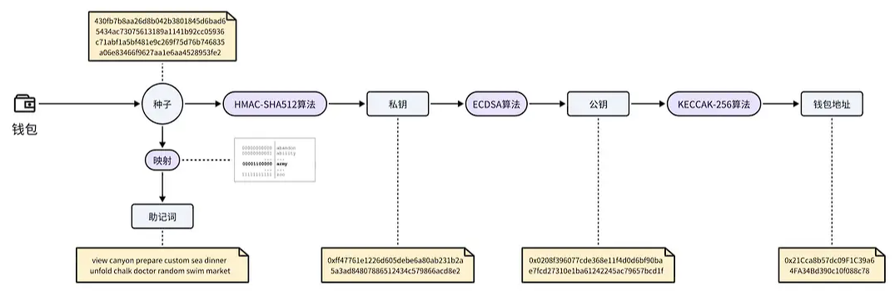

Web3 学习资料参考来自：https://www.hackquest.io/

# 1 Web3 基础知识

## Unit1 - Web3 概述

### 1 Web3 简介

#### 互联网现状和问题

- 在 Web3 之前的互联网时代，用户可以自己生成文字，图片，视频等内容并在社交网络上分享和交流
- 但这也带来了一些问题，这些用户创造和分享的内容可能会被运营平台的公司所控制，并可能导致一系列的隐私和安全问题，用户的个人信息可能会被不当使用或泄漏，这凸显了中心化数据控制的风险和后果

#### Web3 的诞生

- 在这样的互联网背景下，Web3 的概念应运而生。简单来说 Web3 是建立在区块链技术上的下一代互联网
- Web3 强调去中心化，即没有中心化的控制机构来管理数据和资源

#### Web3 的意义

- 用户对自己创造的内容和数据拥有真正的所有权
- Web3 通过智能合约和区块链技术实现的不可篡改和透明性特征，可以促进信任，降低中介成本，减少欺诈
- Web3 还激发了新的商业模式和经济系统
  - 去中心化金融（DeFi）
  - 非同质化代笔（NFTs）
  - 去中心化组织（DAOs）
  - ……
- 不仅是技术革新，更是一场关于数据自主权的社会运动，也反映了人们对隐私保护的更高追求

#### 小结

- 了解 Web3 作为下一代互联网技术的基本概念和重要性
- Web3 不仅解决了传统互联网时代面临的隐私泄露和安全问题，也促进了信任的建立，并降低了交易成本

### 2 Web3 发展历史

#### 互联网诞生过程

- 互联网的诞生源于冷战时期的通信需求。

  - 在 20 世纪 60 年代，美国国防部的高级研究计划局（ARPA）开发了一种分布式网络系统，即 ARPANET
  - 旨在保持即使在核攻击下也能保持通讯线路通常。

  - 这一网络技术经历了 web1.0 -> web2.0 -> web3.0 三个阶段，逐渐演化成了今天的互联网形态

#### Web1.0

- 在 1990 年代初期，随着万维网（World Wide Web, 简称 WWW ）的出现，Web1.0 时代正式拉开序幕
- Web1.0 是互联网的早期形态，以静态网页为主，内容由网站所有者创建和管理，用户主要是信息的接收者
- Web1.0 解决了信息共享和传播问题，但是互动性差，用户只能被动的接受信息，不能对网页内容进行修改或评论，这在很大程度上限制了互联网的发展

#### Web2.0

- Web2.0 开始于2004年左右，极大地解决了用户参与度低的问题，推动了信息的开放共享
- 但也引发了一系列问题和挑战
  - 数据的所有权和平台垄断问题日益突出，用户创造的内容和产生的数据往往由少数几家大公司控制，用户无所有权
  - 隐私泄露问题频繁发生，中心化平台的用户数据信息容易成为黑客攻击的目标。

#### Web3.0

- 由于对 Web2.0 中心化控制和隐私问题的担忧，人们开始探索建立一个更加分散的、由用户主导的网络，这就是 Web3.0 早期的雏形。
- 经过多年的发展，Web3.0 的理念逐渐形成。这一阶段强调去中心化，旨在解决数据的所有权和隐私问题。利用区块链、智能合约和分布式存储等技术，用户可以拥有并控制自己的数据，不必将信息托付给中心化的服务提供商，同时也降低了数据泄露的风险。
- 以太坊这个Web3.0发展中的核心平台之一，它引入了一个关键的创新——智能合约（Smart Contracts），允许在全球范围内无需信任第三方的情况下执行 DApps 代码，扩展了区块链技术的应用场景，极大的推动了 Web3 生态的繁荣发展。
- 虽然 Web3.0 在理论上具备很多优点，但它也面临着一系列的挑战，目前还未得到大规模的普及和应用
  - 包括技术复杂性
  - 用户体验不友好
  - 法律监管等问题

#### 小结

- 互联网的每一次演进都是为了解决前一代技术的不足，体现了人们对数字世界持续不断的探索和追求。
-  Web3.0 目前虽然尚处于发展早期，但其背后的理念 ”赋予用户更多的控制权和隐私保护” 无疑为未来互联网的发展指明了方向。
- 随着技术的进步和用户需求的不断变化，我们可以期待 Web3.0 将继续演进，为我们打开一个全新的数字世界。

### 3 Web3 领域分析（赛道和经典项目）

#### 赛道整体介绍

- 去中心化金融（DeFi）

- 非同质化代币（NFT）

- 去中心化自治组织（DAO）

- 社交金融（SocialFi）

- 游戏金融（GameFi）

- 去中心化身份（DID）

- 基础设施赛道

#### Web3 的赛道简介

- **去中心化金融（DeFi）**
  - 基于区块链，智能合约技术的金融服务和应用，不需要中介机构，一切都是通过代码自动运行的，任何人都可以参与和验证
  - 典型的 Defi 项目有 Uniswap（去中心化交易平台）、Aave（去中心化借贷平台）、MakerDAO（去中心化稳定币 DAI ）等，这些项目推动金融行业向更加开放、透明和包容的方向发展
  - DeFi 还通过分布式账本技术保障了金融交易记录的不可篡改性，从而增强了金融系统的安全性
- **非同质化代币（NFT）**
  - 一种特殊类型的加密资产，它建立在区块链技术之上，通过智能合约保证其唯一性和稀缺性。与传统的加密货币（如比特币或以太坊）不同，每个 NFT 都有独特的身份标识。每个 NFT 就像一件有独特编号的艺术品或收藏品，比如一幅画或一枚限量版邮票，因为它们各自有不同的价值和特征，所以你不能简单地把它们进行交换。
  - 典型的 NFT 项目有数字艺术平台 OpenSea 和 Rarible，这些平台让创作者能够直接向收藏爱好者销售其作品
  - NFT 还可以用于游戏中，例如加密猫（ CryptoKitties ）这个游戏，每只猫咪都是一个独特的 NFT，玩家可以在游戏里购买、繁育和交易猫咪。随着 NFT 技术的成熟和市场的认可， NFT 正在逐渐扩展到更多的领域，如音乐、影视和体育等。
- **去中心化自治组织（DAO）**
  - 是一种基于区块链技术的创新组织形式，它不同于传统的中心化管理结构。在 DAO 中，权力和决策过程是分散的，对于重大的问题，比如资金分配、规则制定和项目发展方向等，不是由单个领导或小团体决定，而是由持有组织代币的成员共同投票决策。DAO 通过把规则写入代码中，由智能合约来自动执行，确保了规则的确定和透明。
  - 去中心化自治组织允许成员在没有中央管理者的情况下共同做出决策，这样的组织形式能够促进更加公平和透明的决策过程，同时也增强了社区成员之间的协作。典型的 DAO 项目有 MolochDAO，它是一个专注于为以太坊生态系统提供资金支持的组织，其运作方式是成员提交提案请求资金，然后其他成员共同投票决定是否批准这些提案，如果有足够多的投票支持，那就会从 DAO 的资金库中拨款来执行这些提案。MolochDAO 的提案信息是公开的，任何人都可以查看项目的介绍、投票和执行情况，从而增加了透明度和社区参与度。
- **社交金融（SocialFi）**
  - 通过区块链技术，实现了社交互动的同时进行资产的生成、交换和增值。与传统社交平台不同的是， SocialFi 平台让用户在参与社交活动如发帖、评论、分享内容时得到实质性的经济奖励，比如代币或 NFT，同时保证了他们对自己数据的所有权和控制权。这种模式打破了传统社交网络的利益分配机制，将价值回馈给内容创造者和社区成员
  - 社交金融重新定义了内容创造和社区参与的奖励系统，用户不仅能享受社交乐趣，还能从中获得实际收益。Mirror 是当前较为主流的 SocialFi 项目之一，Mirror 平台利用区块链技术确保创作者拥有其作品的数字版权，并且能够通过加密货币进行收益分配。比如创作者在平台上发布文章后，可以根据文章的受欢迎程度和用户的互动情况（点赞、分享、评论等），获得相应的代币奖励。创作者还可以在平台上进行众筹活动，使用智能合约创建代币化的众筹项目，这些代币可能会随着创作者的成功而增值，从而吸引投资者支持他们的创作。
- **游戏金融（GameFi）**
  - 是一种结合了加密货币和非同质化代币（ NFT ）的游戏模式，玩家可以在虚拟的游戏世界中参与活动，并通过这些活动获得实际的经济回报。这种游戏模式赋予玩家拥有资产的所有权和交易能力，允许他们自由地买卖、交换或投资这些资产。GameFi 项目往往集成了 DeFi（去中心化金融）的功能，如流动性挖矿、借贷和收益农场，使玩家在享受游戏乐趣的同时，还能参与到复杂的金融活动中。
  - 游戏金融创造了一个全新的经济模型，玩家的时间和技能可以转化为现实世界的财富，同时也促进了数字资产的流通和创新。Axie Infinity 作为典型的 GameFi 项目，让用户通过购买、培育、繁衍及交易虚拟宠物来参与游戏。这些宠物如果拥有稀缺的属性，往往具有更高的市场价值，用户可通过繁殖和销售这些宠物来赚取利润。此外，用户参加战斗也能够赚取 SLP 和 AXS 代币，这些代币可以在加密货币市场兑换成真实的货币。同时，将 AXS 和 SLP 代币质押到 DeFi 协议中，用户还有机会获得额外的收益。
- **去中心化身份（DID）**
  - 是一种基于区块链技术的身份认证方式，使得用户无需依赖于任何中心化组织或服务提供商，就能够拥有并控制自己的身份信息。在这个系统中，用户的身份数据被加密并分散存储在区块链网络上，用户可以自主管理其身份证明和相关数据，使用私钥进行安全验证，以此确保身份信息的可靠性和隐私性。
  - 去中心化身份为用户提供了身份数据主权和隐私保护，一个典型的 DID 项目例子是 ENS（ Ethereum Name Service ），它允许用户将复杂的以太坊钱包地址转换为易读易记的域名，如“ alice.eth ”，从而简化了转账过程，并且提升了用户体验。此外，这些域名也是用户在 Web3 世界的身份标志，通过 ENS，用户可以更方便地管理和展示自己的去中心化身份。
- **基础设施赛道**
  - 基础设施赛道为整个 Web3 生态系统的运行提供了必需的底层技术支持，就像建筑需要坚固的地基那样，基础设施提供一系列的关键技术组件，包括区块链协议、智能合约平台、节点网络、分布式存储和跨链互操作协议等，这些组件确保了所有应用和服务能够安全、高效地运行。
  - 基础设施赛道为 Web3 生态提供了稳固的根基，使得开发者能够构建出更加复杂、功能丰富的去中心化应用。典型的基础设施非常多，比如，以太坊（ Ethereum ）提供了一个智能合约平台，允许开发者在上面创建各种去中心化应用；IPFS（ InterPlanetary File System ）是一个分布式存储网络，解决了数据存储与传输的问题；而 Polkadot 和 Cosmos 等项目则致力于解决区块链间的互操作性问题，允许不同的区块链网络之间进行信息和价值的传递。这些基础设施项目是 Web3 生态发展的基石，对于推动整个行业的创新和成熟起着至关重要的作用。

#### 小结

- Web3 的各赛道犹如百花齐放，共同构建了一个去中心化、透明且充满创新的数字生态系统。
  - 去中心化金融（ DeFi ）通过摒弃中介，实现了开放式的金融交易和服务
  - 非同质化代币（ NFT ）增加了数字资产的独特性和价值
  - 去中心化自治组织（ DAO ）推动了集体决策和公平管理
  - 去中心化身份（ DID ）确保了个人身份数据的安全和隐私
  - 社交金融（ SocialFi ）和游戏金融（ GameFi ）将传统的社交和游戏行为与经济激励结合，重新定义了用户参与的价值
  - 而基础设施赛道则为这一切提供了稳定的技术支持和发展平台。
- 总的来说，Web3 的各赛道不仅推动了技术创新，也为用户赋权，创造了全新的价值流转方式和收益模型，展现了互联网发展的新趋势。

### 4 Web3 未来发展趋势

#### Web3 现状

- Web3 作为区块链技术的一个重要发展阶段，代表了去中心化、无需许可和分布式网络的理念。当前，Web3 尚处在不断演进与完善之中，面临的挑战包括技术成熟度、用户体验、安全性、以及法律法规等方面的不确定性。
- 例如，在以太坊中，交易耗时长，交易费用昂贵，智能合约漏洞导致黑客攻击频繁发生等等。未来随着技术的不断创新和监管框架的建立，这些问题有望得到逐步解决。

#### 从不同角度看 Web3 发展

- **生态角度**
  - 比特币（ Bitcoin ）生态作为最早的区块链实现，其稳定性和安全性得到广泛认可，但由于其功能相对单一，未来可能更多地作为价值存储的角色
  - 以太坊（ Ethereum ）生态则在不断进化，致力于解决扩容和速度问题
  - 波卡（ Polkadot ）生态提供了一个多区块链的联合平台，预计将在未来的 Web3 生态中扮演重要角色
  - 宇宙链（ Cosmos ）生态同样注重互操作性，为构建相互连接的区块链网络提供基础
  - 索拉纳（ Solana ）生态用户体验较好，如果能够持续提供稳定服务，将在 Web3 领域中占据一席之地。
- **从共识机制的角度**
  - 共识机制是 Web3 生态中的重要组成，其发展决定着网络的安全性和去中心化程度。
  - 例如工作量证明机制（ PoW ）因其耗费大量电力资源而受到批评，而更加环保的权益证明机制（ Pos ）则受到更多青睐
  - Web3 生态还发展出了其他多种共识机制，以提供更高效、更安全的网络。随着技术的发展，我们可以期待更多的共识机制出现，以满足日益增长的区块链应用需求。
- **从城市政策的角度**
  - 在全球范围内，许多城市正积极推动 Web3 生态系统的建设，典型的有硅谷、新加坡、香港、迪拜、柏林等，它们通过制定友好的政策和提供优惠条件来吸引区块链创业公司和项目。
  - 新加坡和香港作为国际金融中心，都在积极布局数字资产交易所和加密货币相关的法律框架，未来预计将继续成为 Web3 创新和投资的热点地区
- **从人工智能的角度**
  - AI 的发展为 Web3 带来了新的可能性，两者的结合预计会催生出很多创新
  - 比如通过 AI 算法优化区块链网络的性能、增强智能合约的自动化能力、以及在去中心化金融中实施更复杂的交易策略。
  - 利用 AI 技术，在未来会产生更加个性化的数字助理，更智能的资产管理工具，以及更加精准有效的数据分析和市场预测模型。

- **从现货 ETF 的角度**
  - 美国 BTC 现货 ETF 的通过是加密货币历史上的一个里程碑，它意味着比特币投资正式进入主流金融市场，这将增加比特币的流动性，提高其认可度，并可能为其他加密货币的 ETF 奠定基础。这对 Web3 生态来说，可能会带来更多的资本注入和普通投资者的关注。

#### 小结

- 随着技术的持续进步和法律监管的逐步完善，我们可以预见，Web3 在未来必将发展成为一个多元化和高度互联的生态系统
- 它将结合先进的共识机制、跨链技术、以及人工智能的创新，为全球各行各业提供更高效、更安全的去中心化网络体验。

## Unit2 - 区块链技术知识

### 1 分布式账本和去中心化


#### 中心化账本

- 传统的银行和金融机构使用中心化的帐本系统，所有的交易信息都存在银行的内部数据库中。这种模式让银行称为数据和资金流的控制中心，虽然便于管理，但是也存在着一些弊端。
- 比如个人信息可能存在泄漏的风险，一旦银行系统遭受黑客攻击或内部人员滥用权限，用户的财务数据和个人隐私可能会被非法窃取，甚至被用于欺诈和盗窃

#### 分布式账本

- 2008 年，随着比特币的白皮书的发布，一个被称作区块链的去中心化技术首次进入大家的视野

#### 分布式账本工作原理

- 每一条区块链就是一个分布式账本，所有的交易记录不是存放在一个中央服务器上，而是分散存储在网络中的所有计算节点中，每个节点都有一份交易账本的拷贝，这些拷贝是完全相同且实时更新的。当有新的交易发生时，这个交易会被发送到网络中的所有节点，并通过矿工验证确保其有效性。一旦交易被验证，它就会被添加到账本的最新页面上，也就是区块中，并且这个过程是不可逆的。一旦记录下来，就无法被篡改或删除

#### 分布式账本典型案例

- 比特币，作为第一个成功的加密货币，也是分布式账本的典型应用。比特币网络由超过10000个活跃的全节点组成，这些节点遍布全球各地，任何人都可以运行一个节点，参与到网络的维护中来。节点的多样性与地理分布性，确保了网络的健壮性和抗审查能力。

#### 小结

- 了解分布式账本的基本概念
- 分布式账本这种去中心化的数据管理方式，保证了交易记录的透明、安全和不可篡改，它使得在没有中央权威机构的情况下，网络中的参与者可以达成共识，这是 Web3 能够提供去中心化信任和协作的基础，得到了全球的广泛认可。

### 2 区块链数据结构

#### 前言

- 区块链作为 Web3 生态的核心基础设施，相当于一个分布式数据库，用于存储全球范围内的交易数据、智能合约、用户身份信息和各种类型的去中心化应用（ dApps ）数据。
- 以太坊区块链从上往下可以依次分解为：区块链、区块、交易三个层次，其中的交易数据、收据数据、状态数据和账户数据都分别存储在四棵默克尔树中。

- 本节以以太坊为例，逐层解析区块链的数据结构。

#### 区块链

- 区块链是一系列数据块（即“区块”），通过特定的方式相互连接，形成的一条链。每个区块都包含前一个区块的哈希值，称为“父哈希值”（ Parent Hash ），这是前一个区块内容的唯一标识符
- 通过这种方式，每个区块都与前一个区块相连接，形成了一条从第一个区块（创世区块）到最新区块的连续链条，这就是“区块链”
- 注：第一个区块里无父哈希值。


#### 区块

- 区块链中的每一个区块，都由两个部分组成：
  - 区块头（ Header ）
  - 区块体（ Body ）

##### 区块头

区块头里包含了一个区块的基本信息，主要包括：

- 父哈希值（parentHash）：记录前一个区块的哈希值
- 时间戳（timestamp）：记录区块创建的具体时间
- 随机数（nonce）：用于工作量证明（PoW）机制中的挖矿过程
- 难度目标（difficulty）：表示挖矿的难度
- 基币（coinBase）：标识矿工的账户地址

另外区块头里还记录了三个非常重要的根哈希值：

- 状态树根（stateRoot）：表示了区块链的状态数的根哈希值
  - 状态树记录了所有账户的状态信息，如余额，合约代码等
- 收据树根（receiptRoot）：表示收据树的根哈希值
  - 收据树记录了交易执行的结果，如交易是否成功，交易费用等
- 交易树根（transactionRoot）：表示交易树的根哈希值
  - 交易树记录了区块中所有的交易信息

##### 区块体

区块体里存储了该区块中的所有交易数据，即所有交易哈希的列表。


#### 交易

在以太坊中，交易代表从一个账户向另一个账户发送资产或消息的行为。当用户发起一笔交易时，以太坊客户端或钱包软件将会构造交易数据。交易数据主要包含如下字段：

- nonce：发送方账户的交易计数器，统计该账户在此区块链中的总交易次数
- gasPrice：发送方愿意为每单位 gas 支付的价格
- gasLimit：发送方为这次交易设置的最大 gas 消耗量
- to：接收方的账户地址
- value：要传输的以太币数量
- data：智能合约相关的字节码
- v, r, s：交易签名，由发送方的私钥生成

交易数据构造完成后，钱包将使用用户的私钥对整个交易进行签名，并将签名结果（ v, r, s ）加入交易数据中，然后对整个交易数据（不包括签名）计算哈希值，交易哈希是交易数据的唯一标识符，确保了交易的唯一性和不可篡改。


例如，Alice 想要发送 1 ETH 给 Bob，Alice 的账户地址是 0x123…ABC，Bob 的账户地址是 0x456…DEF。Alice 的账户已经执行过5笔交易，所以她的下一笔交易的 nonce 为6。当前的 gas 价格是 20 Gwei，她设置的 gas limit 是21000（标准以太坊转账所需的gas费）。Alice 不调用任何合约，所以 data 字段为空

- nonce: 6
- gasPrice: 20000000000 (20 Gwei)
- gasLimit: 21000
- to: 0x456…DEF
- value: 1000000000000000000 (1 ETH)
- data: 0x
- v, r, s: [签名数据]

Alice 的钱包会把这些交易数据进行打包和签名，然后生成交易哈希，并将这个交易广播到以太坊网络。矿工将确认这笔交易并将其加入新区块，一旦成功，1 ETH 就会从 Alice 的账户转移到 Bob 的账户

#### 交易收据

在以太坊中，当一笔交易完成后，会生成“交易收据”（ Transaction Receipt，又叫交易回执）。交易收据记录了交易执行的基本信息，是交易被包含在区块链中的重要证据


每个交易收据包含的信息有：

- transactionHash：交易哈希值，用于唯一标识一笔交易
- ransactionIndex：交易在所在区块中的索引位置
- blockHash：包含该交易的区块哈希值
- blockNumber：包含该交易的区块编号
- from：发起交易的地址
- to：交易的目标地址
- cumulativeGasUsed：当前区块中累积消耗的 Gas 量
- gasUsed：这笔交易所消耗的 Gas 量
- contractAddress：如果交易用于创建合约，则表示合约地址；否则为 null
- logs：交易过程中产生的事件日志
- logsBloom：布隆过滤器，用于快速检索交易日志
- status：交易执行的状态码，表示成功或失败

#### 默克尔-帕特里夏树 Merkle Patricia Tree

以太坊每天的交易量达到数百万笔，如此多的交易数据是如何存储的呢？这里采用了一种名为Merkle Patricia Tree（ MPT ）的数据结构，这是一种特殊类型的默克尔树（ Merkle Tree ）。我们先了解一下基本的默克尔树。

##### 默克尔树

- **默克尔树**，也称为哈希树（ Hash Tree ），这棵树的叶子节点是数据块的哈希值，非叶子节点是其子节点的哈希值串联后再次进行哈希计算的结果，这样可以确保数据的完整性。如图所示，节点值的计算方法为：

  - 哈希 A = Hash（数据 A）

  - 哈希 B = Hash（数据 B）
  - 哈希 E = Hash（哈希A + 哈希B）


##### 帕特里夏树

- **帕特里夏树**（ Patricia Trie ），也称为压缩前缀树，这棵树既可以利用字符串的公共前缀来减少查询时间，又可以通过压缩无分支的节点来节省空间。


##### 默克尔-帕特里夏树

- **默克尔-帕特里夏树** （ Merkle Patricia Tree ） 结合了默克尔树（ Merkle Tree ）和帕特里夏树（ Patricia Trie ）的优点，既可以验证数据的完整性，也可以快速检索状态信息，非常适合用作以太坊中的数据存储。在每个区块里，分别有一棵默克尔-帕特里夏树来存储交易数据、收据数据、状态数据和账户数据。

#### 小结

对以太坊区块链的数据结构有了一个基本了解，可以用下面一张图来总结，它是一种高度复杂且精妙的设计，它整个系统能够安全地记录和验证交易，同时保证了网络的去中心化特性。


### 3 哈希函数和区块链链接

#### 前言

- 哈希函数的概念可以追溯到20世纪50年代，当时它主要用于数据结构中，如哈希表，用来快速定位和检索数据。后来哈希函数经历了一系列的发展，旧的标准不断被更安全的新标准所替代：

- MD4—>MD5—>SHA0—>SHA1—>SHA2—>SHA3

- 目前最先进的标准是 SHA-3，SHA-3 基于 Keccak 算法，由比利时密码学家设计，并在2015年成为 NIST 的标准。

#### 什么是哈希函数

- 哈希函数，也称为散列函数。它将任意长度的输入（通常称为“消息”），通过数学算法转换成固定长度的字符串，这个输出通常称为哈希值、散列值、消息摘要或者数字指纹。下图以 SHA3-256 哈希函数来展示，无论输入什么，输出都是一个长度为64的十六进制字符串。


#### 哈希算法的特征

- 正向快速：无论输入的长度有多大，都能够快速计算出哈希值。比如把一个字符或者一本书的所有文字作为输入，都可以快速计算出哈希值

- 逆向困难：通过哈希值，无法在有限时间内逆向推出输入。比如通过哈希值，无法逆向推出输入是 123

  ```
  0x8a5e1d339fafc39350fd8cf1d7ca7982091c27f6b77f75bd4ddab3df425b4f8c
  ```

- 输入敏感：输入的微小变化，会导致输出的显著变化。比如 123 和 124 的哈希值千差万别，看上去没有任何关联

- 避免碰撞：很难找到两个不同的输入，使得输出的哈希值一致（即发生碰撞）。比如很难找到除 123 之外的另一个输入，使它的哈希值也是

  ```
  0x8a5e1d339fafc39350fd8cf1d7ca7982091c27f6b77f75bd4ddab3df425b4f8c
  ```

- 不可预测：通过输入无法预测输出，所以挖矿时随机数nonce只能从1开始累加

#### 区块链中的应用

哈希函数在区块链技术中起到关键作用，主要应用在这几个方面：

- 确保交易数据的完整性和不可篡改性。每笔交易的哈希值都是独一无二的，任何细微的数据变化都会导致哈希值的巨大变化，使得网络参与者能够迅速发现交易数据被篡改的行为。

- 将各个区块串联起来形成区块链，每个区块包含前一个区块的哈希值，从而确保了链上数据的连贯性和不可逆性。

- 用于构建 Merkle 树以高效验证数据。

- 实施工作量证明机制来增强区块链的安全性，通过解决计算难题来限制新区块的生成速度。

另外，哈希函数还与非对称加密结合，为交易提供数字签名，确保了交易的真实性。这些应用共同，保障了区块链网络的安全性和可靠性。

#### 小结

- 学习了哈希函数的基本概念和在区块链中的应用。

- 总结来说，哈希函数是一种将任何长度的数据转换成一个固定长度的字符串的方法。在区块链中，哈希函数使得每笔交易和每个区块都变得独一无二，保证了数据的安全性和不可篡改性，是区块链中的核心工具。

### 4 非对称加密和公私钥体系

#### 对称加密

- 介绍非对称加密之前，我们先来了解一下对称加密

- 在对称加密中，加密和解密使用相同的密钥。意味着发送方和接收方必须事先共享这个密钥，并且都必须保守这个密钥的秘密


- 对称加密存在一个问题，如果钥匙在传递过程丢失（密钥泄露），可能导致保密信件中的内容被别人看到。为了解决这个问题，非对称加密应运而生。

#### 非对称加密

- 非对称加密解决了密钥分发问题，使用一对不同的密钥：公钥和私钥，来进行数据的加密和解密。
- 公钥和私钥需要配对使用，公钥可以公开发放，任何人都可以用它来加密信息，但只有持有私钥的人才能解密这些信息。
- 因此，即使公钥是公开的，没有私钥的人也无法读取加密信息的内容。


- 私钥是唯一能够解开加密信息的钥匙，其他任何人即便拥有公钥也无法解密。通过这种方式，小明和小红确保了保密信件内容的安全性。

#### 公私钥体系

- 公私钥体系是非对称加密的基础。
- 在这个体系中，每个用户都有一对密钥：公钥和私钥，公钥是公开的，而私钥只能由用户自己保管。
- 公私钥体系基于密码学原理，任何人都无法从公钥推导出对应的私钥。
- 除了非对称加密之外，公私钥体系还有一个核心功能：数字签名

#### 小结

- 学习了对称加密和非对称加密，并对公私钥体系有了基本认识。

- 简单来说，对称加密快速但在密钥传递上存在风险
- 而非对称加密则在保护密钥传递方面提供了一个更安全的解决方案

### 5 数字签名和交易验证

#### 前言

- 上一章节，我们介绍了非对称加密：使用公钥进行加密，使用私钥进行解密，这样可以确保信息传输的安全性。
- 小明和小红正是使用了非对称加密技术，才使得保密信件的内容在传递过程中不被泄露。
- 但是仅仅使用非对称加密来保护信件内容是不够的，因为小红的公钥是公开的，任何人都可以使用它来加密信息，假冒小明发送给小红。
- 为了确保小红收到的信件确实来自小明，这里还需要另一种机制来验证消息的真实来源，这就是数字签名技术。

#### 数字签名

数字签名技术使用私钥进行加密，使用公钥进行解密和验证，它能够验证消息是否由指定的发送者发出，并且在传输过程中没有被篡改，以确认信息的完整性和认证发送者的身份。


我们还是以小明给小红发送保密信件来举例，他们不仅使用了非对称加密技术，还使用了数字签名技术。

- 第一步：计算签名。小明先使用自己的私钥对消息密文进行加密，得到消息密文的签名，再将签名附加到消息密文中一起传输，发送给小红。

- 第二步：恢复签名。小红收到消息密文和签名之后，使用公开获得的小明的公钥对签名进行解密，得到消息密文。

- 第三步：验证签名。小红将收到的密文和解密签名恢复出来的密文进行对比，如果两者一致，则签名验证成功，说明收到的信件确实是小明发出的，同时还能证明信件在传输过程中没有被修改。

因为公私钥加密算法执行比较慢，如果消息比较大，签名过程会消耗很长时间。所以在实际应用中，一般先计算消息的哈希值，再计算哈希值的签名，这样可以减少签名耗时。

#### 交易验证

在以太坊中，数字签名技术用于交易验证，确保交易的真实性、完整性。交易验证主要有如下几步：

- 用户签名交易。用户将交易数据准备好后，先计算出交易数据的哈希值，再使用椭圆曲线签名算法（ ECDSA ）对哈希值进行签名，将签名值（ v,r,s ）附加到交易数据中进行广播。
- 矿工验证交易。矿工接收到一笔交易之后，同样，先计算出交易数据（不含签名）的哈希值，再使用椭圆曲线签名算法（ ECDSA ），从签名和哈希值中恢复出用户公钥。最后将恢复出的公钥与用户钱包地址做对比，如果两者一致，则交易验证成功。


初学者来说，为了方便理解，可以简单的认为用户钱包地址就是公钥。但是请注意，实际上两者并不相等，用户钱包地址是由公钥先经过哈希计算，再取末尾20个字节而来的

#### 小结

- 学习了数字签名的概念及其在交易验证中的重要作用。

- 简单来说，数字签名是一种使用私钥加密、公钥解密的技术，它保证了消息的真实性和完整性。通过这种方式，可以验证信息确实由发送者发出，并且在传递过程中未被篡改。这在加密货币交易中非常重要，可以用来确保交易的安全性。

### 6 工作量证明（PoW）

#### PoW 机制历史

- 介绍区块链的工作量证明机制（ Proof of Work，以下简称 PoW ）之前，我们先了解一下 PoW 机制的历史，便于更好的理解它的原理。

- PoW 的概念最初并非为加密货币而生，它在1993年由 Cynthia Dwork 和 Moni Naor 提出，用于抵御电子邮件服务中的垃圾邮件攻击。
- 其基本思想是：要求用户在发送电子邮件之前，先计算一个和邮件内容相关的数学难题，并将计算结果附加在邮件上才能被邮件服务器接收。


- 具体流程如下：
  - 用户编写一封邮件
  - 用户发送邮件前必须先解决一个工作量证明问题，通常是找到一个符合特定条件的数字（ nonce ），比如将邮件内容和这个数字的组合后，使用哈希函数计算出的哈希值前面有4个零。用户在电脑上进行计算，找到这个数字之后，将其附加到邮件上，然后发送
  - 邮件服务器接收到邮件和附加的数字，快速验证工作量证明是否正确（即检查哈希值是否符合要求）
  - 如果工作量证明是正确的，邮件就会被发送至目标邮箱；如果不正确，则拒绝发送
- 工作量证明的计算过程需要消耗一定的计算时间和资源，对于正常用户来说，这个额外的工作量是可接受的，因为它不会影响正常的邮件发送。然而，对于垃圾邮件发送者来说，他们通常要发送成千上万封的垃圾邮件，这个计算过程要消耗大量的时间和资源。通过这样的机制，使得垃圾邮件的发送成本大幅增加，从而有效地减少垃圾邮件的数量。

#### 为什么要使用 PoW 机制

- 2008年，一个化名为中本聪（ Satoshi Nakamoto ）的人将 PoW 机制应用于比特币的创建过程中。

- 比特币是一个去中心化的分布式网络，当用户发起一笔新的交易后，网络中不存在一个中央权威来验证和确认交易。为了抵御恶意攻击，需要一种机制来确保所有网络参与者（节点）对交易记录的有效性和区块链的状态达成一致。PoW 机制解决了这个共识问题，可以为比特币网络提供去中心化的安全保障，使得网络的运行不依赖于任何单一实体，以确保网络的安全性。

#### PoW 机制工作原理

- 在区块链中，PoW 机制是如何工作的呢？

- 如下图，在比特币网络中，PoW 要求矿工通过解决一个数学难题来创建新的区块。这个数学难题实际上是在1~2^256之间找到一个数值（ nonce ），使得区块头信息的哈希值小于或等于网络当前的难度目标（ target ）。这个过程被称为“挖矿”。随着网络中的算力不断变化，为了确保创建区块创建的间隔时间相当，挖矿的难度目标（ target ）也会不断调整。


#### PoW 机制案例讲解

- 举一个简单的例子来解释 PoW 机制的工作过程，我们的目标是找到一个nonce值，使得区块头信息的哈希值小于或等于难度目标（ target ），即哈希值以三个零开头

- 难度目标

  - ```
    000fffffffffffffffffffffffffffffffffffffffffffffffffffffffffffff
    ```

- 矿工在打包交易后，产生的新区块头信息如下

  - ```
    版本：1
    上一个区块的哈希值：00065981574f0735bd36230451d837d12ad19f671a6d76ab0eefc6d55a7e8bec
    Merkle 根：b3a24bbaff8d6de77c2a021e0f3f4a9e8a2f0dbd0ea1eea9ece5f2f424a2bd5b
    时间戳：1582215247
    难度指数：1d00ffff
    Nonce：0（开始尝试的 nonce 值）
    ```

- 矿工的任务是不断改变 Nonce 值（从0开始累加），重新计算区块头的哈希值，直到找到一个小于或等于难度目标的哈希值。矿工开始尝试不同的 Nonce 值：

  - 第 1 次尝试（不满足条件）

    - ```
      Nonce：1
      哈希值：fae998a99254508c137f0c535f8f25fbb69e7cc6af78a7f365546a87314dab77 
      ```

  - 第 2 次尝试（不满足条件）

    - ```
      Nonce：2
      哈希值：001a744a87365442d2593d896bda9942a128fa4c7acb3a47b0dd98c77fb67216
      ```

  - 第 3 次尝试（不满足条件）

    - ```
      Nonce：3
      哈希值：0b3468b4bbc3f1614d592daeff613564ab1678694562a5e0033afa7e71bfffcc
      ```

  - ...

  - 第 23568 次尝试（满足条件，哈希值以三个零开头）

    - ```
      Nonce：23568
      哈希值：00019c284da6661956525526eba9e09d474257b33a221130de29db6b926caca6 
      ```

- 当尝试了23568次之后，即 Nonce 值为23568时，矿工找到了一个满足条件的哈希值（以三个零开头），这就意味着挖矿成功，新的区块可以被添加到区块链上。此时其他节点的矿工将验证这个区块是否符合难度要求，一旦验证正确，矿工将停止本次挖矿，立即开始下一个区块的挖矿

- 这是一个简化版的挖矿。在现实中，比特币网络的难度目标更加复杂，矿工通常需要尝试数十亿次 Nonce 值，才能找到符合条件的哈希值。新区块被添加到区块链上之后，创建区块的矿工将获得一定的代币奖励，比如2024年比特币减半后，挖矿奖励是3.125个比特币

#### 最长链原则

- 在比特币网络中，有大量的矿工在同时挖矿，很容易同时出现多个合法区块，导致区块链分叉。分叉后新创建的区块将添加到哪条链中呢？

- 此时矿工遵循最长链原则，默认选择最长的一条链，即总算力最大的链，作为有效链继续挖矿，因为最长链代表了网络中最大的工作量。


#### 小结

- 学习了 PoW 机制的原理和在比特币中的应用。

- 总结来说，PoW 机制有效的解决了去中心化分布式网络中的共识问题，允许系统中的各个节点在没有中央权威或相互信任的情况下达成一致，至今已成为许多加密货币广泛使用的共识算法。PoW 机制也使得对系统的攻击变得非常困难，因为攻击者需要控制超过50%的网络算力才能影响区块链的状态（51%攻击）。

- 然而，PoW 机制也有劣势，例如高能耗和潜在的中心化风险。2014年 [GHash.IO](http://ghash.io/) 矿池的算力一度占到了全球比特币网络算力的一半以上，它理论上有能力进行“51%攻击”，引起社区的广泛关注，后来 GHash.IO 自愿降低了自己的算力份额，承诺不会超过全网的39.99%。

### 7 权益证明（PoS）

#### 前言

- 在区块链技术发展初期，最广为人知的共识机制是 PoW 工作量证明。
- 然而，随着时间的推移，人们逐渐意识到 PoW 机制存在一些问题，例如
  - 电力能耗巨大和算力集中化
  - 网络去中心化的特性受到威胁。
- 为了解决这些问题，权益证明机制（ Proof of Stake, 以下简称 PoS ）应运而生。

#### 工作原理

- 与 PoW 机制不同，PoS 机制不依赖于算力竞争。

  - 参与者通过质押一定数量的加密货币，来获得成为区块创建者（也称为验证者）的资格。

  - 每次创建新区块时，区块链协议会从所有质押的验证者中随机抽选一名

  - 当被抽中的验证者创建一个区块后，其他节点将会对该区块进行验证

  - 如果验证通过，该区块就会被添加到区块链上，并且创建者将获得一定的加密货币作为奖励。

- 每个验证者被抽中的概率与质押的金额大小有关，通常质押越多的验证者被抽中的机会越大。
- 例如，在以太坊2.0版本中，验证者至少需要质押32个以太币（ ETH ）才有资格创建区块。通过这种方式，PoS 机制实现一个更高效、更节能的区块链网络。


#### 小结

- 我们学习了 PoS 机制的工作原理和价值。

- 简单来说，PoS 机制大幅降低了网络运行所需的能源消耗，并通过经济激励（如交易费用和区块奖励）鼓励持币者参与到网络中。
- 此外，PoS 机制还设有惩罚措施，如“质押削减”，如果验证者行为不当或试图攻击网络，他们将失去一部分或全部质押的代币。
- 总的来说，PoS机制通过奖励和惩罚的手段鼓励验证者诚实地行事，共同维护以太坊网络的安全和稳定。

### 8 其他共识算法

在区块链技术中，除了著名的工作量证明（ PoW ）和权益证明（ PoS ）两种共识机制外，还有很多其他的共识算法被采用。

#### 常见的共识算法

- **历史证明（ PoH ）**：PoH 旨在通过创建一个可信的时间记录来验证事件的顺序和时间，使得网络参与者可以在没有互相通信的情况下验证事件发生的先后顺序。
- **实用拜占庭容错算法（ PBFT ）**：用于容忍系统内一定比例的节点存在恶意行为的情况，确保全网能够达成一致。PBFT 非常适用于私有或联盟链。
- **委托权益证明（ DPoS ）**：这是一种增强版的 PoS，用户将投票权委托给少数代表，这些代表负责验证和添加新的区块到区块链。DPoS 旨在提高网络的可扩展性和交易速度。
- **权威证明（ PoA ）**：在 PoA 中，交易和区块的验证是由预先选定的、受信任的节点（验证者）完成的。这些节点通常会因为身份的公开而承担责任，适用于那些需要速度和效率的网络。
- **纯权益证明（ Pure PoS ）**：PPoS 消除了 PoS 中的潜在中心化问题，通过随机选择验证者来确保网络的去中心化和安全性。
- **空间证明（ PoSpace ）或容量证明（ PoC ）**：这类算法基于网络参与者提供的存储空间大小来选择区块生产者，它的优点是对电力能源的消耗较低。
- **认证证明（ PoAuth ）：**类似于 PoA，但 PoAuth 要求验证者的身份是公开的，他们通常是由社区信任的人或公司

#### 小结

- 这一小节，我们学习了 PoW 和 PoS 之外的共识算法。
- 随着区块链技术的进步，共识算法也在不断演进，向更高效、安全、去中心化的方向发展。
- 另外，未来人工智能也将提升共识机制的性能和可靠性，推动区块链技术向更高层次演进。

## Unit3 - 钱包原理和安全

### 1 钱包地址生成和作用

#### 前言

- 在 Web3 生态中，钱包扮演着一个至关重要的角色，因为钱包中保存着可以让你控制资产的关键信息：私钥

- 与真实世界的钱包不同，Web3 钱包并不直接存储加密货币（加密货币都存储在区块链中），**只用来管理和交易加密货币**

- 钱包地址可以当做你在区块链上的账号，它是一个公开的字符串，主要用于接收和发送加密货币。就像你的银行卡账号一样，人们需要知道你的钱包地址才能向你转账。同样，当你想要给别人转账时，你也需要知道对方的钱包地址

- 比如，这是一个标准的以太坊钱包地址：

  ```
  0x21Cca8b57dc09F1C39a64FA34Bd390c10f088c78
  ```

#### 钱包地址的生成过程



关键步骤：

- 第一步：生成种子。种子是一个随机生成的数字序列，是后续的起点。种子可以由系统生成的随机数或用户提供的熵（比如随机移动鼠标产生的数据）来产生
- 第二步：生成助记词。助记词是将种子转换成的一系列方便记忆的单词。在以太坊中，有一个固定的2048个单词的单词库，首先将种子分割成多个二进制数据片段，每一个片段对应单词库中的一个单词，最终形成一串单词序列，即助记词
- 第三步：生成私钥。私钥是控制钱包地址的密钥。使用上一步的种子，通过 HMAC-SHA512 算法进行计算，可以得到私钥
- 第四步：生成公钥。有了私钥之后，通过椭圆曲线加密算法（ ECDSA ），我们可以计算出对应的公钥
- 第五步：生成地址。最后一步是生成钱包地址。首先使用 Keccak-256 哈希函数计算公钥的哈希值，然后取哈希值的最后20个字节，就是一个以太坊钱包地址

#### 小结

- 学习了钱包的基本概念和钱包地址的生成过程

- 在整个钱包地址的生成过程中，每一步都使用了严格的密码学算法来确保安全性，保证了每个人都能拥有一个独一无二的地址。再次提醒，请妥善保管好私钥和助记词，且必须保密存放，一旦泄露，那么相应地址上的资产就可能会被盗走

### 2 钱包类型和功能

#### 常见的钱包类型

在 Web3 生态中，随着区块链技术的普及和应用的增多，出现了各种类型的钱包，以适应不同用户的需求和提高交易的便捷性。这些钱包类型大致可以分为以下几类：

- **软件钱包**：软件钱包是一种在电脑或移动设备上安装的应用程序，它们可以是桌面钱包、移动钱包或网页钱包
  - **桌面钱包**：桌面钱包安装在个人电脑上，提供安全性较高的存储选项，但对设备有一定依赖性。如 Electrum、Exodus
  - **移动钱包**：移动钱包安装在智能手机上，方便用户随时随地进行交易。如 Trust Wallet、MetaMask 移动版
  - **网页钱包**：网页钱包通过浏览器访问，方便快捷，但安全性较低，更适合小额交易。如 MyEtherWallet、MetaMask 网页版
- **硬件钱包**：硬件钱包是一种物理设备，外形类似 U 盘，可以离线存储私钥，具有非常高的安全性。它们不容易受到网络攻击，但价格相对较高，适合长期存储大量资产。如 Ledger Nano S、Trezor
- **纸钱包**：简单来说，纸钱包就是将公钥和私钥打印在纸上，完全离线，避免了在线攻击的可能，但纸质材料容易损坏，且不便于频繁交易
- **托管钱包**：托管钱包由第三方服务商管理，用户只需注册账户即可使用，它们操作简便，对初学者友好，用户不必担心私钥的安全和管理问题，但需要信任并依赖服务商的安全性和稳定性。如 Binance 交易所提供的钱包
- **多签钱包**：多签钱包顾名思义，需要多个签名才能执行交易，提供了额外的安全性。这种钱包适合团队和合作伙伴之间的资产管理，如 Gnosis Safe

#### 如何选择钱包

每种钱包都有其独特的使用场景和优势。用户在选择钱包时，需要根据自己的需求和对安全性、便捷性的偏好来决定。例如：

- 对于重视安全的用户，硬件钱包或纸质钱包可能是最佳选择

- 对于经常交易的用户，移动钱包或网页钱包可能更合适，因为它们提供更快的访问和操作

- 对初学者来说，如果不想管理私钥又担心私钥泄露，托管钱包可能是一个比较好的选择。

#### 小结

- 学习了常见的钱包类型和选择钱包的方式

- 总之，钱包是管理资产的核心工具，用户在选择钱包时尽量将安全作为第一要素来考虑

### 3 钱包安全和密钥管理

#### 钱包安全最佳实践

- 在 Web3 的世界里，钱包不仅仅是管理加密资产的工具，还是你在去中心化网络上的身份凭证。
- 钱包的安全直接关系到你的资产安全，如果别人得到了你的私钥，就像是别人拿到了你的银行卡密码，他们就可以完全控制你的钱包和里面的资产。
- 因此，钱包的安全非常重要，下面介绍一些保护钱包和管理私钥的最佳实践：
  - **保密你的私钥和助记词**：私钥和助记词必须保密，永远不要分享给任何人。如果需要备份，请使用纸和笔记下来，并进行多份备份，妥善保管在安全的地方
  - **使用硬件钱包**：硬件钱包相比软件钱包来说，提供了更高级别的安全性。它可以离线存储你的私钥，减少私钥泄露或被黑客攻击的风险
  - **启用多重认证**：启用多重认证（如两步验证）可以增加一层安全保障，比如托管钱包的邮箱认证和身份验证器认证。即使黑客知道了你的密码，没有第二层认证，他们也无法转走你钱包里的资产
  - **定期更新软件**：确保你的钱包软件和相关应用都是最新版本，这样能够及时修复已知的安全漏洞
  - **防范钓鱼攻击**：时刻警惕钓鱼攻击，请在使用钱包签名前确认消息是否正确，并且不要点击来历不明的邮件或链接，不要在不安全的网站上输入私钥信息
  - **分散风险**：请不要将所有资产存放在一个钱包中，可以考虑分散存放到不同的钱包，以降低被盗风险
  - **保持警惕**：随时关注 Web3 相关的安全新闻和更新，了解新的安全威胁和防护措施

#### 小结

- 学习了保护钱包和管理私钥的常见措施。
- 总之，Web3 钱包的安全性不容忽视。通过上述措施，你可以显著降低钱包被盗的风险。
- 记住，时刻保持安全意识和养成良好的习惯是保护数字资产的关键

## Unit4 - 区块链应用场景

### 1 比特币及其应用

#### 比特币简介

- 比特币是一种去中心化加密货币，由一个化名为中本聪（ Satoshi Nakamoto ）的人或组织在2009年创建，但中本聪的真实身份至今未知。
- 与传统的法定货币（如美元、欧元、人民币等）不同，比特币没有中央银行来控制或发行。它只有电子形式，没有物理实体，只允许用户通过互联网来进行交易，且每一笔交易都是公开透明的，所有交易信息都记录在区块链这个分布式账本上。

#### 区块链技术在比特币中的应用

比特币是第一个应用区块链技术的加密货币，主要体现在如下几个方面：

- **分布式账本**：在比特币中，区块链记录了自比特币网络创建以来发生的所有交易，每一笔交易都会被打包进一个“区块”中，这些区块通过复杂的加密技术链接起来，形成一个连续不断的链条
- **去中心化**：由于区块链是去中心化的，所有的比特币交易信息并不是存储在一个单一的中心服务器上，而是分布在整个网络的所有节点上，每一个节点都有一份完整的账本拷贝。这种设计使得比特币网络很难以被攻击或篡改，因为要改变区块链上的交易信息，黑客需要同时控制网络上大于50%的节点
- **安全性**：在比特币区块链的每个区块中，不仅包含了交易数据，还包含了该区块的哈希值和前一个区块的哈希值。哈希值相当于区块的数字指纹，一旦区块中的交易数据被篡改，那么哈希值也会随之改变，使得篡改行为被立即发现。这一设计保证了比特币网络的安全性和不可篡改性
- **挖矿与共识机制**：在比特币中，矿工基于工作量证明机制（ PoW ）来维护区块链。矿工使用强大的计算机来解决复杂的数学难题（寻找满足难度目标的 nonce 值），这个过程称为“挖矿”。当矿工成功解决一个难题后，他们就可以将交易打包成一个新的区块，并广播到网络中由其他矿工来验证，一旦验证正确，该新区块将会被添加到区块链中。作为回报，创建新区块的矿工会获得一定数量的比特币，这是比特币发行的唯一方式

#### 小结

- 学习了比特币的基本概念和使用的区块链技术。
- 区块链技术为比特币交易提供了去中心化、安全且透明的框架，这一突破性的技术为加密货币的发展和 Web3 生态系统的构建提供了坚实的基础，开启了一个全新的数字金融时代。

### 2 以太坊和智能合约

#### 以太坊简介

- 2013年，一个年轻的程序员、同时也是比特币的狂热爱好者 Vitalik Buterin 注意到，比特币的区块链技术具有极大的潜力，但是其功能只用于处理货币交易。他想要创建一个更加灵活的平台，除了货币交易，开发者还能够构建各种应用。于是，以太坊于2015年应运而生。

- 以太坊同样是一个开源的、去中心化的区块链平台，它不仅支持原生的加密货币：以太币（ ETH ），还提供了一个运行去中心化应用程序（ DApps ）的生态系统。这些应用程序通过智能合约来实现，运行在以太坊虚拟机（ EVM ）上。如果说比特币是一个全球分布式账本，那么以太坊就是一个全球分布式计算机。

#### 智能合约

- 智能合约是以太坊平台的灵魂所在，它们是存储在区块链上的、可以自动执行的代码，代码中包含了所有的运行规则。当预设的条件被满足时，合约便会自动执行相关的功能。

- 你可以把以太坊想象成一台自动售货机，你走到这台售货机前，选择了一瓶可乐，然后将需要的以太币（ ETH ）投入到售货机中。售货机内部运行的程序（智能合约）会自动验证你的支付，然后立即向你投递一瓶可乐。
- 购买可乐的整个过程由智能合约来控制，无需第三方中介，降低了交易成本。智能合约代码是完全开源的，这样确保了交易的透明性。

#### 以太坊和比特币的区别

在区块链世界中，比特币和以太坊是最著名的两个平台，尽管都使用了区块链技术，但它们在设计、目标和应用上有着本质的区别。两者的主要区别如下：


#### 小结

- 学习了以太坊的基本概念和其关键功能：智能合约，了解了以太坊和比特币的主要区别。
- 尽管比特币和以太坊有着显著的区别，但它们都是区块链技术革命的关键参与者，共同促进了全球 Web3 生态的发展。

### 3 去中心化金融

#### DeFi 简介

- 去中心化金融（Decentralized Finance，简称 DeFi），是一种运行在区块链技术之上的金融生态系统。
- 它通过智能合约（自执行的程序代码），实现了金融服务的自动化，同时也消除了传统金融体系中存在的中介机构如银行、经纪人等
- 在 DeFi 的世界里，所有的交易和服务都是透明的、无需许可的，并且对所有连接到互联网中的人都开放

#### DeFi 的价值

与传统的中心化金融（ Cefi ）相比，去中心化金融在可访问性、透明度、安全性、效率、创新性和去中心化等方面具有显著价值

- **无地理限制**：首先，DeFi 通过提供无国界的金融服务，确保全球的用户只需要连接互联网，就能够不受地理限制地进行交易。这对于那些传统银行服务不足或不可获得的地区尤其重要
- **公开透明**：其次，DeFi 利用区块链技术公开记录所有交易，使得任何人都可以验证和审计这些记录。这种开放性极大地增加了系统的透明度和可信度，用户可以直观地看到资金流动，减少了隐藏费用和潜在的不正当行为
- **安全效率**：在安全性上，DeFi 通过先进的加密技术来保护用户的资金和交易，大幅降低了欺诈行为和黑客攻击的风险。自动化的智能合约还确保了交易的无缝执行，无需传统金融机构复杂的手续和人工审核，从而提高了操作的效率
- **创新性**：在创新方面，DeFi 所提供的开放式开发平台吸引了全球的开发者参与，促使新的金融产品和服务不断涌现。这种基于社区的发展模式促进了创意的交流和快速迭代，加速了金融领域的技术进步
- **可靠稳定**：最后，与传统金融机构可能存在宕机的风险不同，DeFi 的分布式结构从本质上消除了单一控制点，增强了整个系统对于故障和攻击的抵抗力。即便部分节点受损，整个网络仍可持续运行，保障了金融服务的连续性和稳定性

#### DeFi 典型项目

Defi 的典型项目有 Uniswap，它是一个建立在以太坊区块链上的去中心化交易所（ DEX ）。Uniswap 基于一套全新的自动做市商( AMM )模型，而不是传统的订单簿系统，允许用户无需中介即可交易不同的加密货币

交易流程如下：

- 第一步：用户（流动性提供者）将他们的代币对存入资金池，比如往交易池存入一定数量的 ETH-USDT 代币对，为交易提供所需的流动性。

- 第二步：其他用户需要兑换代币时，比如用 ETH 兑换 USDT，他们只需要将ETH转入交易所，智能合约会自动按照当前的汇率进行交易，再转出指定数量的 USDT。

在 Uniswap 中进行交易，用户不需要信任任何第三方，因为所有交易都是通过代码自动完成的，这降低了欺诈和中介风险。

#### 小结

- 学习了 DeFi 的基本概念和典型项目

- DeFi 代表了金融领域的一次革命，它通过技术创新，为用户提供了更多的选择和自由。虽然当前仍面临许多挑战，比如用户体验差、法律监管不健全等，但随着技术的进步，我们相信 DeFi 将在未来的金融行业扮演越来越重要的角色。

### 4 非同质化代币（NFT）

#### NFT 简介

- 在介绍非同质化代币（ NFT ）之前，我们需要先了解“同质化”和“非同质化”的概念

- 在加密货币的世界里，同质化代表着可互换性。比如你拥有1个 BTC，而我也拥有1个 BTC，尽管这两个 BTC 可能在不同的钱包地址中，但它们具有相同的价值，可以直接交换，这就像你用一张100元的钞票换另一张同样面额的100元钞票一样

- 而非同质化代表着独一无二，不可替代。非同质化代币（ NFT ），正是这样一种唯一且不可互换的数字资产。NFT 通常用于证明资产的所有权，比如数字艺术品、收藏品等

#### NFT 的价值

与同质化代币相比，非同质化代币（ NFT ）在所有权验证、独特性、收藏价值、市场流通性以及参与性等方面具有独特的价值。具体如下：

- 首先，NFT 作为一种区块链技术的产物，能够为数字资产提供不可篡改的所有权证明。这意味着艺术家和内容创造者可以确保他们的原创作品被合法地认证和追踪，从而保护了他们的知识产权。

- 其次，由于每个 NFT 都是不可替代的，它们固有的稀缺性成为了价值的重要来源。尤其是对于那些独特的艺术品来说，这种稀缺性赋予了 NFT 较高的收藏价值。

- 再者，尽管 NFT 是非同质化的，但它们在全球范围内的多个平台上仍然可以被买卖和交换，这为 NFT 提供了流通性。随着市场的不断发展，这种流通性正在不断增强。

- 最后，部分 NFT 项目允许持有者对项目的发展进行投票，或者提供社区特定的福利。这增强了用户体验，使得 NFT 变得不仅仅是一个收藏品，而是一个拥有社群和生态的活跃项目。

#### NFT 典型项目

- 以 CryptoPunks 为例，这是一个在以太坊上非常著名的NFT项目。CryptoPunks 是由 Larva Labs studio 创造的一系列10,000个像素艺术角色，每个角色都是独一无二的，且已经成为了加密艺术和文化的象征。它们不仅仅是图片，更是身份和地位的象征。CryptoPunks 项目的成功在于它结合了艺术、稀缺性和社区的力量，创造了巨大的经济价值和文化影响力。

#### 小结

- 学习了 NFT 的基本概念和典型项目。
- NFT 开辟了数字艺术和收藏品的新市场，为用户提供独特的体验和权益。未来，NFT 可能会继续在艺术、游戏、娱乐和其他领域拓展其应用，提供更丰富的交互方式和更加完善的所有权记录。
- 随着技术的发展和法律法规的完善，NFT 可能会成为数字身份和资产所有权证明的重要工具

### 5 去中心化自治组织（DAO）

#### DAO 简介

- 去中心化自治组织（ Decentralized Autonomous Organization，简称 DAO ）是一种基于区块链技术的组织形式，它通过智能合约来自动执行组织的规则和决策。
- 与传统的公司不同，DAO 没有管理层和中心权威，所有的决策都通过成员投票或预设算法来实现。
- 组织成员通常持有代币，这些代币赋予了他们投票权，这样成员就可以直接参与到组织的治理中，比如提出提案、投票决定项目方向、资金分配等。

#### DAO 的价值

与传统的公司相比，DAO 在透明度、信任要求、运营效率、参与民主性以及安全性等方面具有显著的优势。

- 首先，DAO 的所有决策过程和财务交易都是公开记录在区块链上的，任何外部审计者都可以轻松进行验证，从而提高了组织的透明度。

- 其次，在 DAO 中，成员之间的互动是通过代码执行的，成员只需信任这些智能合约的代码本身，不需要像在传统公司那样信任个别领导或者某个中心化的团队。

- 再者，由于智能合约可以自动执行任务，这降低了手工处理的需求，消除了许多不必要的中介环节，提升了组织运作的效率。

- 此外，DAO 允许每一个持有代币的成员参与到组织的决策中去，这种机制推动了更加民主化的决策过程，使得组织真正地由社区成员驱动。

- 最后，区块链技术的使用加强了 DAO 的安全性，因为它依赖于加密技术和共识算法来保护数据和资产，从而在很大程度上避免了外部攻击和内部滥用的风险。

#### DAO 典型项目

- 以 MakerDAO 为例，它是一个运行在以太坊上的去中心化借贷平台。用户可以抵押加密资产（如 ETH ），来生成一个稳定币 DAI。DAI 的价值锚定美元，旨在减少加密货币的价格波动风险。

- MakerDAO 的治理结构是典型的 DAO 模式。持有 MKR 代币的用户有权参与到 Maker 系统的治理中，包括调整稳定币 DAI 的发行政策、抵押物种类、风险参数等。这些决策都是通过公开、透明的投票过程完成的。

#### 小结

- 学习了 DAO 的基本概念和典型项目。
- DAO 是区块链技术应用的一次创新尝试，它打破了传统组织结构的限制，提供了一种全新的组织和协作方式。虽然当前还存在一些挑战，如法律认可度、技术安全性等，但它的潜力和发展空间是巨大的。
- 随着社会对去中心化模式的认可度提高，未来 DAO 将成为企业和社区治理的重要工具

